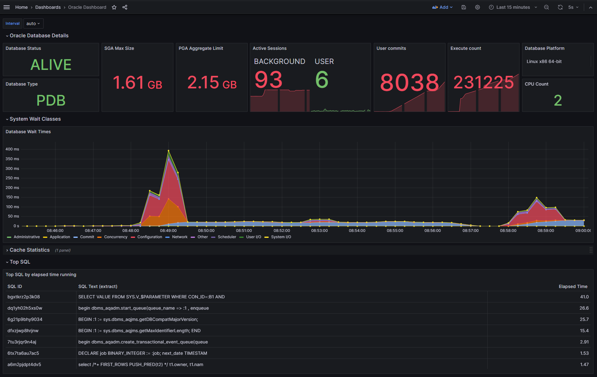

# Unified Observability for Oracle Database 

This project aims to provide observability for the Oracle Database so that users can understand performance and diagnose issues easily across applications and database.  Over time, this project will provide not just metrics, but also logging and tracing support, and integration into popular frameworks like Spring Boot.  The project aims to deliver functionality to support both cloud and on-premises databases, including those running in Kubernetes and containers.

From the first production release, v1.0, onwards, this project provides a [Prometheus](https://prometheus.io/) exporter for Oracle Database that is based in part on a Prometheus exporter created by [Seth Miller](https://github.com/iamseth/oracledb_exporter) with changes to comply with various Oracle standards and policies. 

Contributions are welcome - please see [contributing](CONTRIBUTING.md).


### Table of Contents

- [Release Notes](#release-notes)
- [Roadmap](#roadmap)
- [Standard metrics](#standard-metrics)
- [Database permissions required](#database-permissions-required)
- [Alert logs](#alert-logs)
- [Installation](#installation)
   - [Docker, podman, etc.](#docker-podman-etc)
   - [Test/demo environment using Docker Compose](#testdemo-environment-with-docker-compose)
   - [Kubernetes](#kubernetes)
   - [Standalone binary](#standalone-binary)
   - [Using OCI Vault](#using-oci-vault)
- [Custom metrics](#custom-metrics)
- [Controlling memory usage](#controlling-memory-usage)
- [Grafana dashboards](#grafana-dashboards)
- [Monitoring Transactional Event Queues](#monitoring-transactional-event-queues)
- [Developer notes](#developer-notes)

## Release Notes

### Version 1.5.0, September 26, 2024

This release includes the following changes:

- Support for running the exporter on ARM processors (darwin and linux).
- Updated some third-party dependencies.
- Updated the "test/demo environment" to use newer version of Oracle Database (23.5.0.24.07) and faster startup.

### Version 1.4.0, September 4, 2024

This release includes the following changes:

- Allow mulitple custom metrics defintion files.
- Allow query timeout per-metric.
- Allow scrape interval per-metric.
- Updated some third-party dependencies.

### Version 1.3.1, July 22, 2024

This release includes the following changes:

- Alert logs can be disabled by setting parameter `log.disable` to `1`.
- Alert log exporter will stop if it gets three consecutive failures.
- Updated the list of required permissions.
- Updated the TxEventQ sample dashboard.
- Updated some third-party dependencies.

Thank you to the following people for their suggestions and contributions:

- [@tux-jochen](https://github.com/tux-jochen)

### Version 1.3.0, June 7, 2024

This release includes the following changes:

- Alert logs can be exported for collection by a log reader like Promtail or FluentBit. Default
  output to `/log/alert.log` in JSON format.
- Provide ability to connect as SYSDBA or SYSOPER by setting DB_ROLE.
- New default metric is added to report the type of database connected to (CDB or PDB).
- New default metrics are added for cache hit ratios.
- Deafult metrics updated to suppress spurious warnings in log.
- Wait class metric updated to use a better query.
- The sample dashboard is updated to include new metrics.
- Fixed a bug which prevented periodic freeing of memory.
- Set CLIENT_INFO to a meaningful value.
- Update Go toolchain to 1.22.4.
- Updated some third-party dependencies.

Thank you to the following people for their suggestions and contributions:

- [@pioro](https://github.com/pioro)
- [@savoir81](https://github.com/savoir81)

### Version 1.2.1, April 16, 2024

This release includes the following changes:

- Accept max idle and open connections settings as parameters.
- Updated some third-party dependencies.

### Version 1.2.0, January 17, 2024

This release includes the following changes:

- Introduced a new feature to periodically restart the process if requested.
- Introduced a new feature to periodically attempt to free OS memory if requested.
- Updated some third-party dependencies.

### Version 1.1.1, November 28, 2023

This release just updates some third-party dependencies.

### Version 1.1, October 27, 2023

This release includes the following changes: 

- The query for the standard metric `wait_class` has been updated so that it will work in both container databases
  and pluggable databases, including in Oracle Autonomous Database instances.  Note that this query will not return
  any data unless the database instance is under load.
- Support for reading the database password from OCI Vault has been added (see [details](#using-oci-vault))
- Log messages have been improved
- Some dependencies have been updated

### Version 1.0, September 13, 2023

The first production release, v1.0, includes the following features: 

- A number of [standard metrics](#standard-metrics) are exposed,
- Users can define [custom metrics](#custom-metrics),
- Oracle regularly reviews third-party licenses and scans the code and images, including transitive/recursive dependencies for issues,
- Connection to Oracle can be a basic connection or use an Oracle Wallet and TLS - connection to Oracle Autonomous Database is supported,
- Metrics for Oracle Transactional Event Queues are also supported,
- A Grafana dashboard is provided for Transacational Event Queues, and
- A pre-built container image is provided, based on Oracle Linux, and optimized for size and security.

Note that this exporter uses a different Oracle Database driver which in turn uses code directly written by Oracle to access the database.  This driver does require an Oracle client.  In this initial release, the client is bundled into the container image, however we intend to make that optional in order to minimize the image size. 

The interfaces for this version have been kept as close as possible to those of earlier alpha releases in this repository to assist with migration.  However, it should be expected that there may be breaking changes in future releases.

## Roadmap

We always welcome input on features you would like to see supported.  Please open an issue in this repository with your suggestions. 

Currently, we plan to address the following key features:

- Implement multiple database support - allow the exporter to publish metrics for multiple database instances,
- Implement connection storm protection - prevent the exporter from repeatedly connecting when the credentials fail, to prevent a storm of connections causing accounts to be locked across a large number of databases,
- Provide the option to have the Oracle client outside of the container image, e.g., on a shared volume,
- Implement the ability to update the configuration dynamically, i.e., without a restart,
- Implement support for exporting logs, including audit logs for example, from the database,
- Implement support for tracing within the database, e.g., using an execution context ID provide by an external caller,
- Provide additional pre-built Grafana dashboards,
- Integration with Spring Observability, e.g., Micrometer,
- Provide additional documentation and samples, and
- Integrate with the Oracle Database Operator for Kubernetes.

## Standard metrics

The following metrics are exposed by default:

```
# HELP oracledb_activity_execute_count Generic counter metric from v$sysstat view in Oracle.
# TYPE oracledb_activity_execute_count gauge
oracledb_activity_execute_count 64469
# HELP oracledb_activity_parse_count_total Generic counter metric from v$sysstat view in Oracle.
# TYPE oracledb_activity_parse_count_total gauge
oracledb_activity_parse_count_total 25883
# HELP oracledb_activity_user_commits Generic counter metric from v$sysstat view in Oracle.
# TYPE oracledb_activity_user_commits gauge
oracledb_activity_user_commits 158
# HELP oracledb_activity_user_rollbacks Generic counter metric from v$sysstat view in Oracle.
# TYPE oracledb_activity_user_rollbacks gauge
oracledb_activity_user_rollbacks 2
# HELP oracledb_db_platform_value Database platform
# TYPE oracledb_db_platform_value gauge
oracledb_db_platform_value{platform_name="Linux x86 64-bit"} 1
# HELP oracledb_db_system_value Database system resources metric
# TYPE oracledb_db_system_value gauge
oracledb_db_system_value{name="cpu_count"} 2
oracledb_db_system_value{name="pga_aggregate_limit"} 2.147483648e+09
oracledb_db_system_value{name="sga_max_size"} 1.610612736e+09
# HELP oracledb_dbtype Type of database the exporter is connected to (0=non-CDB, 1=CDB, >1=PDB).
# TYPE oracledb_dbtype gauge
oracledb_dbtype 0
# HELP oracledb_exporter_build_info A metric with a constant '1' value labeled by version, revision, branch, goversion from which oracledb_exporter was built, and the goos and goarch for the build.
# TYPE oracledb_exporter_build_info gauge
oracledb_exporter_build_info{branch="",goarch="amd64",goos="linux",goversion="go1.22.4",revision="unknown",tags="unknown",version=""} 1
# HELP oracledb_exporter_last_scrape_duration_seconds Duration of the last scrape of metrics from Oracle DB.
# TYPE oracledb_exporter_last_scrape_duration_seconds gauge
oracledb_exporter_last_scrape_duration_seconds 0.040507382
# HELP oracledb_exporter_last_scrape_error Whether the last scrape of metrics from Oracle DB resulted in an error (1 for error, 0 for success).
# TYPE oracledb_exporter_last_scrape_error gauge
oracledb_exporter_last_scrape_error 0
# HELP oracledb_exporter_scrapes_total Total number of times Oracle DB was scraped for metrics.
# TYPE oracledb_exporter_scrapes_total counter
oracledb_exporter_scrapes_total 3
# HELP oracledb_process_count Gauge metric with count of processes.
# TYPE oracledb_process_count gauge
oracledb_process_count 79
# HELP oracledb_resource_current_utilization Generic counter metric from v$resource_limit view in Oracle (current value).
# TYPE oracledb_resource_current_utilization gauge
oracledb_resource_current_utilization{resource_name="branches"} 0
oracledb_resource_current_utilization{resource_name="cmtcallbk"} 0
oracledb_resource_current_utilization{resource_name="dml_locks"} 0
oracledb_resource_current_utilization{resource_name="enqueue_locks"} 43
oracledb_resource_current_utilization{resource_name="enqueue_resources"} 31
oracledb_resource_current_utilization{resource_name="gcs_resources"} 0
oracledb_resource_current_utilization{resource_name="gcs_shadows"} 0
oracledb_resource_current_utilization{resource_name="ges_big_msgs"} 0
oracledb_resource_current_utilization{resource_name="ges_cache_ress"} 0
oracledb_resource_current_utilization{resource_name="ges_locks"} 0
oracledb_resource_current_utilization{resource_name="ges_procs"} 0
oracledb_resource_current_utilization{resource_name="ges_reg_msgs"} 0
oracledb_resource_current_utilization{resource_name="ges_ress"} 0
oracledb_resource_current_utilization{resource_name="ges_rsv_msgs"} 0
oracledb_resource_current_utilization{resource_name="k2q_locks"} 0
oracledb_resource_current_utilization{resource_name="max_rollback_segments"} 22
oracledb_resource_current_utilization{resource_name="max_shared_servers"} 2
oracledb_resource_current_utilization{resource_name="parallel_max_servers"} 2
oracledb_resource_current_utilization{resource_name="processes"} 80
oracledb_resource_current_utilization{resource_name="sessions"} 95
oracledb_resource_current_utilization{resource_name="smartio_buffer_memory"} 0
oracledb_resource_current_utilization{resource_name="smartio_metadata_memory"} 0
oracledb_resource_current_utilization{resource_name="smartio_overhead_memory"} 0
oracledb_resource_current_utilization{resource_name="smartio_sessions"} 0
oracledb_resource_current_utilization{resource_name="sort_segment_locks"} 2
oracledb_resource_current_utilization{resource_name="temporary_table_locks"} 0
oracledb_resource_current_utilization{resource_name="transactions"} 0
# HELP oracledb_resource_limit_value Generic counter metric from v$resource_limit view in Oracle (UNLIMITED: -1).
# TYPE oracledb_resource_limit_value gauge
oracledb_resource_limit_value{resource_name="branches"} -1
oracledb_resource_limit_value{resource_name="cmtcallbk"} -1
oracledb_resource_limit_value{resource_name="dml_locks"} -1
oracledb_resource_limit_value{resource_name="enqueue_locks"} 5542
oracledb_resource_limit_value{resource_name="enqueue_resources"} -1
oracledb_resource_limit_value{resource_name="gcs_resources"} -1
oracledb_resource_limit_value{resource_name="gcs_shadows"} -1
oracledb_resource_limit_value{resource_name="ges_big_msgs"} -1
oracledb_resource_limit_value{resource_name="ges_cache_ress"} -1
oracledb_resource_limit_value{resource_name="ges_locks"} -1
oracledb_resource_limit_value{resource_name="ges_procs"} 0
oracledb_resource_limit_value{resource_name="ges_reg_msgs"} -1
oracledb_resource_limit_value{resource_name="ges_ress"} -1
oracledb_resource_limit_value{resource_name="ges_rsv_msgs"} 0
oracledb_resource_limit_value{resource_name="k2q_locks"} -1
oracledb_resource_limit_value{resource_name="max_rollback_segments"} 65535
oracledb_resource_limit_value{resource_name="max_shared_servers"} -1
oracledb_resource_limit_value{resource_name="parallel_max_servers"} 32767
oracledb_resource_limit_value{resource_name="processes"} 300
oracledb_resource_limit_value{resource_name="sessions"} 472
oracledb_resource_limit_value{resource_name="smartio_buffer_memory"} -1
oracledb_resource_limit_value{resource_name="smartio_metadata_memory"} -1
oracledb_resource_limit_value{resource_name="smartio_overhead_memory"} -1
oracledb_resource_limit_value{resource_name="smartio_sessions"} -1
oracledb_resource_limit_value{resource_name="sort_segment_locks"} -1
oracledb_resource_limit_value{resource_name="temporary_table_locks"} -1
oracledb_resource_limit_value{resource_name="transactions"} -1
# HELP oracledb_sessions_value Gauge metric with count of sessions by status and type.
# TYPE oracledb_sessions_value gauge
oracledb_sessions_value{status="ACTIVE",type="BACKGROUND"} 65
oracledb_sessions_value{status="ACTIVE",type="USER"} 7
oracledb_sessions_value{status="INACTIVE",type="USER"} 1
# HELP oracledb_tablespace_bytes Generic counter metric of tablespaces bytes in Oracle.
# TYPE oracledb_tablespace_bytes gauge
oracledb_tablespace_bytes{tablespace="SYSAUX",type="PERMANENT"} 5.7442304e+08
oracledb_tablespace_bytes{tablespace="SYSTEM",type="PERMANENT"} 1.101135872e+09
oracledb_tablespace_bytes{tablespace="TEMP",type="TEMPORARY"} 0
oracledb_tablespace_bytes{tablespace="UNDOTBS1",type="UNDO"} 4.1353216e+07
oracledb_tablespace_bytes{tablespace="USERS",type="PERMANENT"} 1.048576e+06
# HELP oracledb_tablespace_free Generic counter metric of tablespaces free bytes in Oracle.
# TYPE oracledb_tablespace_free gauge
oracledb_tablespace_free{tablespace="SYSAUX",type="PERMANENT"} 1.7939390464e+10
oracledb_tablespace_free{tablespace="SYSTEM",type="PERMANENT"} 1.7936965632e+10
oracledb_tablespace_free{tablespace="TEMP",type="TEMPORARY"} 1.7947820032e+10
oracledb_tablespace_free{tablespace="UNDOTBS1",type="UNDO"} 3.4318368768e+10
oracledb_tablespace_free{tablespace="USERS",type="PERMANENT"} 1.7930805248e+10
# HELP oracledb_tablespace_max_bytes Generic counter metric of tablespaces max bytes in Oracle.
# TYPE oracledb_tablespace_max_bytes gauge
oracledb_tablespace_max_bytes{tablespace="SYSAUX",type="PERMANENT"} 1.8513813504e+10
oracledb_tablespace_max_bytes{tablespace="SYSTEM",type="PERMANENT"} 1.9038101504e+10
oracledb_tablespace_max_bytes{tablespace="TEMP",type="TEMPORARY"} 1.7947820032e+10
oracledb_tablespace_max_bytes{tablespace="UNDOTBS1",type="UNDO"} 3.4359721984e+10
oracledb_tablespace_max_bytes{tablespace="USERS",type="PERMANENT"} 1.7931853824e+10
# HELP oracledb_tablespace_used_percent Gauge metric showing as a percentage of how much of the tablespace has been used.
# TYPE oracledb_tablespace_used_percent gauge
oracledb_tablespace_used_percent{tablespace="SYSAUX",type="PERMANENT"} 3.102672714489066
oracledb_tablespace_used_percent{tablespace="SYSTEM",type="PERMANENT"} 5.783853352019611
oracledb_tablespace_used_percent{tablespace="TEMP",type="TEMPORARY"} 0
oracledb_tablespace_used_percent{tablespace="UNDOTBS1",type="UNDO"} 0.1203537561196118
oracledb_tablespace_used_percent{tablespace="USERS",type="PERMANENT"} 0.005847560493698568
# HELP oracledb_teq_curr_inst_id ID of current instance
# TYPE oracledb_teq_curr_inst_id gauge
oracledb_teq_curr_inst_id 1
# HELP oracledb_top_sql_elapsed SQL statement elapsed time running
# TYPE oracledb_top_sql_elapsed gauge
oracledb_top_sql_elapsed{sql_id="01uy9sb7w8a9g",sql_text=" begin      dbms_aqadm_sys.remove_all_nondurablesub(:1,"} 0.147496
oracledb_top_sql_elapsed{sql_id="0nakmm882vmq0",sql_text="select /* QOSH:DROP_STAT_HIST_PARTS */ partition_name, "} 0.072836
oracledb_top_sql_elapsed{sql_id="0sbbcuruzd66f",sql_text="select /*+ rule */ bucket_cnt, row_cnt, cache_cnt, null"} 0.072226
oracledb_top_sql_elapsed{sql_id="121ffmrc95v7g",sql_text="select i.obj#,i.ts#,i.file#,i.block#,i.intcols,i.type#,"} 0.17176
oracledb_top_sql_elapsed{sql_id="20x4skzx6dbjm",sql_text="INSERT INTO OPATCH_XINV_TAB(XML_INVENTORY) SELECT * FRO"} 2.656821
oracledb_top_sql_elapsed{sql_id="3un99a0zwp4vd",sql_text="select owner#,name,namespace,remoteowner,linkname,p_tim"} 0.069393
oracledb_top_sql_elapsed{sql_id="3wrrjm9qtr2my",sql_text="SELECT T.CLIENT_ID,         T.OPERATION_ID,         T.T"} 0.309885
oracledb_top_sql_elapsed{sql_id="44dn40afubks4",sql_text="select decode(u.type#, 2, u.ext_username, u.name), o.na"} 0.098865
oracledb_top_sql_elapsed{sql_id="586577qpbkgnk",sql_text="select 1 from DBA_SCHEDULER_JOBS  where JOB_NAME like '"} 0.072079
oracledb_top_sql_elapsed{sql_id="5yutdqf5nvrmt",sql_text="SELECT     dt.tablespace_name as tablespace,     dt.con"} 0.081922
oracledb_top_sql_elapsed{sql_id="8gbt6t0s3jn0t",sql_text="MERGE /*+ OPT_PARAM('_parallel_syspls_obey_force' 'fals"} 0.068104
oracledb_top_sql_elapsed{sql_id="b9c6ffh8tc71f",sql_text="BEGIN dbms_output.enable(NULL); END;"} 0.0982
oracledb_top_sql_elapsed{sql_id="cz8wbmy7k5bxn",sql_text="begin sys.dbms_aq_inv.internal_purge_queue_table(:1, :2"} 0.181691
# HELP oracledb_up Whether the Oracle database server is up.
# TYPE oracledb_up gauge
oracledb_up 1
# HELP oracledb_wait_time_administrative counter metric from system_wait_class view in Oracle.
# TYPE oracledb_wait_time_administrative counter
oracledb_wait_time_administrative 0
# HELP oracledb_wait_time_application counter metric from system_wait_class view in Oracle.
# TYPE oracledb_wait_time_application counter
oracledb_wait_time_application 0.03
# HELP oracledb_wait_time_cluster counter metric from system_wait_class view in Oracle.
# TYPE oracledb_wait_time_cluster counter
oracledb_wait_time_cluster 0
# HELP oracledb_wait_time_commit counter metric from system_wait_class view in Oracle.
# TYPE oracledb_wait_time_commit counter
oracledb_wait_time_commit 0.04
# HELP oracledb_wait_time_concurrency counter metric from system_wait_class view in Oracle.
# TYPE oracledb_wait_time_concurrency counter
oracledb_wait_time_concurrency 0.56
# HELP oracledb_wait_time_configuration counter metric from system_wait_class view in Oracle.
# TYPE oracledb_wait_time_configuration counter
oracledb_wait_time_configuration 0.15
# HELP oracledb_wait_time_network counter metric from system_wait_class view in Oracle.
# TYPE oracledb_wait_time_network counter
oracledb_wait_time_network 0
# HELP oracledb_wait_time_other counter metric from system_wait_class view in Oracle.
# TYPE oracledb_wait_time_other counter
oracledb_wait_time_other 16.44
# HELP oracledb_wait_time_scheduler counter metric from system_wait_class view in Oracle.
# TYPE oracledb_wait_time_scheduler counter
oracledb_wait_time_scheduler 0.59
# HELP oracledb_wait_time_system_io counter metric from system_wait_class view in Oracle.
# TYPE oracledb_wait_time_system_io counter
oracledb_wait_time_system_io 1.62
# HELP oracledb_wait_time_user_io counter metric from system_wait_class view in Oracle.
# TYPE oracledb_wait_time_user_io counter
oracledb_wait_time_user_io 24.5
```

## Database permissions required

For the built-in default metrics, the database user that the exporter uses to connect to the Oracle Database instance must have the `SELECT_CATALOG_ROLE` privilege and/or `SELECT` permission on the following objects:

- dba_tablespace_usage_metrics
- dba_tablespaces
- v$system_wait_class
- v$asm_diskgroup_stat
- v$datafile
- v$sysstat
- v$process
- v$waitclassmetric
- v$session
- v$resource_limit
- v$parameter
- v$database
- v$sqlstats
- v$sysmetric
- v$diag_alert_ext (for alert logs only)

## Alert logs

The exporter can export alert log records into a file that is suitable for collection by a log ingestion tool like Promtail or FluentBit.

You can specify the interval that log records should be published using the parameter `log.interval` using a GoLang duration
string.  A duration string is a possibly signed sequence of decimal numbers, each with optional fraction and a unit suffix, 
such as "300ms", "-1.5h" or "2h45m". Valid time units are "ns", "us" (or "µs"), "ms", "s", "m", "h", "d", "w", "y".

You can specify the location of the output log file using the environment variable `LOG_DESTINATION`.
The default is `/log/alert.log`.  If you are running in Kubernetes, you should mount a volume
on `/log` so that it can be accessed by both the exporter container and your log collector container.

The output is formatted as one JSON record per line, which most log collection tools will be able to parse with minimal configuration.

Here is an example of the output:

```
{"timestamp":"2023-09-02T05:40:43.626Z","moduleId":"","ecid":"","message":"Starting ORACLE instance (restrict) (OS id: 1473)"}
{"timestamp":"2023-09-02T05:40:43.64Z","moduleId":"","ecid":"","message":"****************************************************"}
{"timestamp":"2023-09-02T05:40:43.64Z","moduleId":"","ecid":"","message":" Sys-V shared memory will be used for creating SGA "}
{"timestamp":"2023-09-02T05:40:43.64Z","moduleId":"","ecid":"","message":" ****************************************************"}
{"timestamp":"2023-09-02T05:40:43.641Z","moduleId":"","ecid":"","message":"**********************************************************************"}
{"timestamp":"2023-09-02T05:40:43.641Z","moduleId":"","ecid":"","message":"Dump of system resources acquired for SHARED GLOBAL AREA (SGA) "}
{"timestamp":"2023-09-02T05:40:43.642Z","moduleId":"","ecid":"","message":" Domain name: kubepods.slice/kubepods-besteffort.slice/kubepods-besteffort-poda2061467_5334_40c3_9328_71be8196ee89.slice/crio-09918aac8159cea"}
{"timestamp":"2023-09-02T05:40:43.642Z","moduleId":"","ecid":"","message":" Per process system memlock (soft) limit = 64K"}
{"timestamp":"2023-09-02T05:40:43.642Z","moduleId":"","ecid":"","message":" Expected per process system memlock (soft) limit to lock"}
{"timestamp":"2023-09-02T05:40:43.642Z","moduleId":"","ecid":"","message":" instance MAX SHARED GLOBAL AREA (SGA) into memory: 1532M"}
{"timestamp":"2023-09-02T05:40:43.643Z","moduleId":"","ecid":"","message":" Available system pagesizes:"}
{"timestamp":"2023-09-02T05:40:43.643Z","moduleId":"","ecid":"","message":"  4K, 2048K "}
{"timestamp":"2023-09-02T05:40:43.643Z","moduleId":"","ecid":"","message":" Supported system pagesize(s):"}
{"timestamp":"2023-09-02T05:40:43.643Z","moduleId":"","ecid":"","message":"  PAGESIZE  AVAILABLE_PAGES  EXPECTED_PAGES  ALLOCATED_PAGES  ERROR(s)"}
{"timestamp":"2023-09-02T05:40:43.644Z","moduleId":"","ecid":"","message":"        4K       Configured               5           391529        NONE"}
{"timestamp":"2023-09-02T05:40:43.644Z","moduleId":"","ecid":"","message":"     2048K                0             766                0        NONE"}
```

You may disable alert logs by setting the parameter `log.disable` to `1`.

## Installation

There are a number of ways to run the exporter.  In this section you will find information on running the exporter:

- In a container runtime like [Docker, Podman, etc](#docker-podman-etc)
- In a test/demo environment using [Docker Compose](#testdemo-environment-with-docker-compose)
- In [Kubernetes](#kubernetes)
- As a [standalone binary](#standalone-binary)

### Docker, Podman, etc.

You can run the exporter in a local container using a conatiner image from [Oracle Container Registry](https://container-registry.oracle.com).  The container image is available in the "observability-exporter" repository in the "Database" category.  No authentication or license presentment/acceptance are required to pull this image from the registry.

#### Oracle Database 

If you need an Oracle Database to test the exporter, you can use this command to start up an instance of [Oracle Database 23ai Free](https://www.oracle.com/database/free/) which also requires no authentication or license presentment/acceptance to pull the image.

If you are running on a Mac with an Mx processor you need to install and run [colima] (https://github.com/abiosoft/colima) to make the 23a Free database run in the Mac platform. Run this command to start colima:

```bash
colima start --arch x86_64 --memory 8 --vm-type=vz --mount-type virtiofs
```

```bash
docker run --name free23ai \
    -d \
    -p 1521:1521 \
    -e ORACLE_PWD=Welcome12345 \
    container-registry.oracle.com/database/free:latest
```

This will pull the image and start up the database with a listener on port 1521. It will also create a pluggable database (a database container) called "FREEPDB1" and will set the admin passwords to the password you specified on this command.

You can tail the logs to see when the database is ready to use:

```bash
docker logs -f free23ai

(look for this message...)
#########################
DATABASE IS READY TO USE!
#########################
```

To obtain the IP address of the container, which you will need to connect to the database, use this command.  Note: depending on your platform and container runtime, you may be able to access the database at "localhost":

```bash
docker inspect free23ai | grep IPA
    "SecondaryIPAddresses": null,
    "IPAddress": "172.17.0.2",
            "IPAMConfig": null,
            "IPAddress": "172.17.0.2",
```

#### Exporter 

You need to give the exporter the connection details for the Oracle Database that you want it to run against.  You can use a simple connection, or a wallet. 

##### Simple connection

For a simple connection, you will provide the details using these variables: 

- `DB_USERNAME` is the database username, e.g., `pdbadmin`
- `DB_PASSWORD` is the password for that user, e.g., `Welcome12345`
- `DB_CONNECT_STRING` is the connection string, e.g., `free23ai:1521/freepdb`
- `DB_ROLE` (Optional) can be set to `SYSDBA` or `SYSOPER` if you want to connect with one of those roles, however Oracle recommends that you connect with the lowest possible privileges and roles necessary for the exporter to run.

To run the exporter in a container and expose the port, use a command like this, with the appropriate values for the environment variables:

```bash
docker run -it --rm \
    -e DB_USERNAME=pdbadmin \
    -e DB_PASSWORD=Welcome12345 \
    -e DB_CONNECT_STRING=free23ai:1521/freepdb \
    -p 9161:9161 \
    container-registry.oracle.com/database/observability-exporter:1.5.0
```

##### Using a wallet

For a wallet connection, you must first set up the wallet.  If you are using Oracle Autonomous Database, for example, you can download the wallet from the Oracle Cloud Infrastructure (OCI) console.  

1. Unzip the wallet into a new directory, e.g., called `wallet`.
1. Edit the `sqlnet.ora` file and set the `DIRECTORY` to `/wallet`.  This is the path inside the exporter container where you will provide the wallet.
1. Take a note of the TNS name from the `tnsnames.ora` that will be used to connect to the database, e.g., `devdb_tp`.

Now, you provide the connection details using these variables: 

- `DB_USERNAME` is the database username, e.g., `pdbadmin`
- `DB_PASSWORD` is the password for that user, e.g., `Welcome12345`
- `DB_CONNECT_STRING` is the connection string, e.g., `devdb_tp?TNS_ADMIN=/wallet`
- `ORACLE_HOME` is the location of the Oracle Instant Client, i.e., `/lib/oracle/21/client64/lib`.  If you built your own container image, the path may be different.

To run the exporter in a container and expose the port, use a command like this, with the appropriate values for the environment variables, and mounting your `wallet` directory as `/wallet` in the container to provide access to the wallet:

```bash
docker run -it --rm \
    -e DB_USERNAME=pdbadmin \
    -e DB_PASSWORD=Welcome12345 \
    -e DB_CONNECT_STRING=devdb_tp \
    -v ./wallet:/wallet \
    -p 9161:9161 \
    container-registry.oracle.com/database/observability-exporter:1.5.0
```


### Test/demo environment with Docker Compose

If you would like to set up a test environment with the exporter, you can use the provided "Docker Compose" file in this repository which will start an Oracle Database instance, the exporter, Prometheus and Grafana.

If you are running on a Mac with an Mx processor you need to install and run [colima] (https://github.com/abiosoft/colima) to make the 23a Free database run in the Mac platform. Run this command to start colima:

```bash
colima start --arch x86_64 --memory 8 --vm-type=vz --mount-type virtiofs

```bash
cd docker-compose
docker-compose up -d
```

The containers will take a short time to start.  The first time, the Oracle container might take a few minutes to start while it creates the database instance, but this is a one-time operation, and subequent restarts will be much faster (a few seconds). 

Once the containers are all running, you can access the services using these URLs:

- [Exporter](http://localhost:9161/metrics)
- [Prometheus](http://localhost:9090) - try a query for "oracle".
- [Grafana](http://localhost:3000) - username is "admin" and password is "grafana".  An Oracle Database dashboard is provisioned and configured to use data from the exporter.

### Kubernetes

To run the exporter in Kubernetes, you need to complete the following steps.  All steps must be completed in the same Kunernetes namespace.  The examples below assume you want to use a namespace called `exporter`, you must change the commands if you wish to use a different namespace.

#### Create a secret with credentials for connecting to the Oracle Database

Create a secret with the Oracle database user and password that the exporter should use to connect to the database using this command.  You must specify the correct user and password for your environment.  This example uses `pdbadmin` as the user and `Welcome12345` as the password: 

```bash
kubectl create secret generic db-secret \
    --from-literal=username=pdbadmin \
    --from-literal=password=Welcome12345 \
    -n exporter
```

#### Create a config map for the wallet (optional)

Create a config map with the wallet (if you are using one) using this command.  Run this command in the `wallet` directory you created earlier.

```bash
kubectl create cm db-metrics-tns-admin \
    --from-file=cwallet.sso \
    --from-file=ewallet.p12 \
    --from-file=ewallet.pem \
    --from-file=keystore.jks \
    --from-file=ojdbc.properties \
    --from-file=sqlnet.ora \
    --from-file=tnsnames.ora \
    --from-file=truststore.jks \
    -n exporter
```

#### Create a config map for you metrics definition file (optional)

If you have defined any [custom metrics](#custom-metrics), you must create a config map for the metrics definition file.  For example, if you created a configuration file called `txeventq-metrics.toml`, then create the config map with this command: 

```bash
kubectl create cm db-metrics-txeventq-exporter-config \
    --from-file=txeventq-metrics.toml \
    -n exporter
```

#### Deploy the Oracle Database Observability exporter

A sample Kubernetes manifest is provided [here](/kubernetes/metrics-exporter-deployment.yaml).  You must edit this file to set the namespace you wish to use, the database connect string to use, and if you have any custom metrics, you will need to uncomment and customize some sections in this file.

Once you have made the necessary updates, apply the file to your cluster using this command: 

```bash
kubectl apply -f metrics-exporter-deployment.yaml
```

You can check the deployment was successful and monitor the exporter startup with this command:

```bash
kubectl get pods -n exporter -w
```

You can view the exporter's logs with this command: 

```bash
kubectl logs -f svc/metrics-exporter -n exporter
```

#### Create a Kubernetes service for the exporter

Create a Kubernetes service to allow access to the exporter pod(s).  A sample Kubernetes manifest is provided [here](/kubernetes/metrics-exporter-service.yaml).  You may need to customize this file to update the namespace. 

Once you have made any necessary udpates, apply the file to your cluster using this command: 

```bash
kubectl apply -f metrics-exporter-service.yaml
```

#### Create a Kubernetes service monitor

Create a Kubernetes service monitor to tell Prometheus (for example) to collect metrics from the exporter.  A sample Kubernetes manifest is provided [here](/kubernetes/metrics-service-monitor.yaml).  You may need to customize this file to update the namespace. 

Once you have made any necessary udpates, apply the file to your cluster using this command: 

```bash
kubectl apply -f metrics-service-monitor.yaml
```

#### Configure a Prometheus target (optional)

You may need to update your Prometheus configuration to add a target.  If so, you can use this example job definition as a guide:

```yaml
  - job_name: 'oracle-exporter'
    metrics_path: '/metrics'
    scrape_interval: 15s
    scrape_timeout: 10s
    static_configs:
    - targets: 
      - metrics-exporter.exporter.svc.cluster.local:9161
```

#### Import Grafana dashboard definition(s) (optional)

See [Grafana dashboards](#grafana-dashboards) below.


### Standalone binary

Pre-compiled versions for Linux 64 bit can be found under [releases](https://github.com/oracle/oracle-db-appdev-monitoring/releases).

In order to run, you'll need the [Oracle Instant Client Basic](http://www.oracle.com/technetwork/database/features/instant-client/index-097480.html)
for your operating system. Only the basic version is required for execution.

The following command line arguments (flags) can be passed to the exporter:

```bash
Usage of oracledb_exporter:
      --web.telemetry-path="/metrics"  
                                 Path under which to expose metrics. (env: TELEMETRY_PATH)
      --default.metrics="default-metrics.toml"  
                                 File with default metrics in a TOML file. (env: DEFAULT_METRICS)
      --custom.metrics=""        Comma separated list of file(s) that contain various custom metrics in a TOML format. (env: CUSTOM_METRICS)
      --query.timeout=5          Query timeout (in seconds). (env: QUERY_TIMEOUT)
      --database.maxIdleConns=0  Number of maximum idle connections in the connection pool. (env: DATABASE_MAXIDLECONNS)
      --database.maxOpenConns=10  
                                 Number of maximum open connections in the connection pool. (env: DATABASE_MAXOPENCONNS)
      --scrape.interval=0s       Interval between each scrape. Default is to scrape on collect requests.
      --log.disable=0            Set to 1 to disable alert logs
      --log.interval=15s         Interval between log updates (e.g. 5s).
      --log.destination="/log/alert.log"  
                                 File to output the alert log to. (env: LOG_DESTINATION)
      --web.listen-address=:9161 ...  
                                 Addresses on which to expose metrics and web interface. Repeatable for multiple addresses.
      --web.config.file=""       Path to configuration file that can enable TLS or authentication. See: https://github.com/prometheus/exporter-toolkit/blob/master/docs/web-configuration.md
      --log.level=info           Only log messages with the given severity or above. One of: [debug, info, warn, error]
      --log.format=logfmt        Output format of log messages. One of: [logfmt, json]
      --[no-]version             Show application version.

```

### Using OCI Vault

The exporter will read the password from a secret stored in OCI Vault if you set these two environment
variables: 

- `VAULT_ID` should be set to the OCID of the OCI vault that you wish to use
- `VAULT_SECRET_NAME` should be set to the name of the secret in the OCI vault which contains the database password

## Custom metrics

The exporter allows definition of arbitrary custom metrics in one or more TOML files. To specify this file to the
exporter, you can:

- Use `--custom.metrics` flag followed by a comma separated list of TOML files, or
- Export `CUSTOM_METRICS` variable environment (`export CUSTOM_METRICS=my-custom-metrics.toml,my-other-custom-metrics.toml`)

Custom metrics file must contain a series of `[[metric]]` definitions, in TOML. Each metric definition must follow the custom metric schema:

| Field Name       | Description                                                                                                                                                                                 | Type                              | Required | Default                           |
|------------------|---------------------------------------------------------------------------------------------------------------------------------------------------------------------------------------------|-----------------------------------|----------|-----------------------------------|
| context          | Metric context, used to build metric FQN                                                                                                                                                    | String                            | Yes      |                                   |
| labels           | Metric labels, which must match column names in the query. Any column that is not a label will be parsed as a metric                                                                        | Array of Strings                  | No       |                                   |
| metricsdesc      | Mapping between field(s) in the request and comment(s)                                                                                                                                      | Dictionary of Strings             | Yes      |                                   |
| metricstype      | Mapping between field(s) in the request and [Prometheus metric types](https://prometheus.io/docs/concepts/metric_types/)                                                                    | Dictionary of Strings             | No       |                                   |
| metricsbuckets   | Split [histogram](https://prometheus.io/docs/concepts/metric_types/#histogram) metric types into buckets based on value ([example](./custom-metrics-example/metric-histogram-example.toml)) | Dictionary of String dictionaries | No       |                                   |
| fieldtoappend    | Field from the request to append to the metric FQN                                                                                                                                          | String                            | No       |                                   |
| request          | Oracle database query to run for metrics scraping                                                                                                                                           | String                            | Yes      |                                   |
| ignorezeroresult | Whether or not an error will be printed if the request does not return any results                                                                                                          | Boolean                           | No       | false                             |
| querytimeout     | Oracle Database query timeout duration, e.g., 300ms, 0.5h                                                                                                                                   | String duration                   | No       | Value of query.timeout in seconds |
| scrapeinterval   | Custom metric scrape interval, used if scrape.interval is provided, otherwise metrics are always scraped on request.                                                                        | String duration                   | No       |                                   |

Here's a simple example of a metric definition:

```
[[metric]]
context = "test"
request = "SELECT 1 as value_1, 2 as value_2 FROM DUAL"
metricsdesc = { value_1 = "Simple example returning always 1.", value_2 = "Same but returning always 2." }
```

> NOTE: Do not add a semicolon (`;`) at the end of the SQL queries.

This file produce the following entries in the exporter:

```
# HELP oracledb_test_value_1 Simple example returning always 1.
# TYPE oracledb_test_value_1 gauge
oracledb_test_value_1 1
# HELP oracledb_test_value_2 Same but returning always 2.
# TYPE oracledb_test_value_2 gauge
oracledb_test_value_2 2
```

You can also provide labels using `labels` field. Here's an example providing two metrics, with and without labels:

```
[[metric]]
context = "context_no_label"
request = "SELECT 1 as value_1, 2 as value_2 FROM DUAL"
metricsdesc = { value_1 = "Simple example returning always 1.", value_2 = "Same but returning always 2." }

[[metric]]
context = "context_with_labels"
labels = [ "label_1", "label_2" ]
request = "SELECT 1 as value_1, 2 as value_2, 'First label' as label_1, 'Second label' as label_2 FROM DUAL"
metricsdesc = { value_1 = "Simple example returning always 1.", value_2 = "Same but returning always 2." }
```

This TOML file produces the following result:

```
# HELP oracledb_context_no_label_value_1 Simple example returning always 1.
# TYPE oracledb_context_no_label_value_1 gauge
oracledb_context_no_label_value_1 1
# HELP oracledb_context_no_label_value_2 Same but returning always 2.
# TYPE oracledb_context_no_label_value_2 gauge
oracledb_context_no_label_value_2 2
# HELP oracledb_context_with_labels_value_1 Simple example returning always 1.
# TYPE oracledb_context_with_labels_value_1 gauge
oracledb_context_with_labels_value_1{label_1="First label",label_2="Second label"} 1
# HELP oracledb_context_with_labels_value_2 Same but returning always 2.
# TYPE oracledb_context_with_labels_value_2 gauge
oracledb_context_with_labels_value_2{label_1="First label",label_2="Second label"} 2
```

Last, you can set metric type using **metricstype** field.

```
[[metric]]
context = "context_with_labels"
labels = [ "label_1", "label_2" ]
request = "SELECT 1 as value_1, 2 as value_2, 'First label' as label_1, 'Second label' as label_2 FROM DUAL"
metricsdesc = { value_1 = "Simple example returning always 1 as counter.", value_2 = "Same but returning always 2 as gauge." }
# Can be counter or gauge (default)
metricstype = { value_1 = "counter" }
```

This TOML file will produce the following result:

```
# HELP oracledb_test_value_1 Simple test example returning always 1 as counter.
# TYPE oracledb_test_value_1 counter
oracledb_test_value_1 1
# HELP oracledb_test_value_2 Same test but returning always 2 as gauge.
# TYPE oracledb_test_value_2 gauge
oracledb_test_value_2 2
```

You can find [working examples](./custom-metrics-example/custom-metrics.toml) of custom metrics for slow queries, big queries and top 100 tables.
An exmaple of [custom metrics for Transacational Event Queues](./custom-metrics-example/txeventq-metrics.toml) is also provided.

### Customize metrics in a container image

If you run the exporter as a container image and want to include your custom metrics in the image itself, you can use the following example `Dockerfile` to create a new image:

```Dockerfile
FROM container-registry.oracle.com/database/observability-exporter:1.5.0
COPY custom-metrics.toml /
ENTRYPOINT ["/oracledb_exporter", "--custom.metrics", "/custom-metrics.toml"]
```

## Controlling memory usage

If you are running in an environment with limited memory, or you are running a large number of exporters, you may want to control the exporter's usage of memory.

Under normal circumstances, the exporter process will retain OS memory that was used by the Go garbage collector but is no longer needed, in case it may be needed again in the future, unless the host OS is under memory pressure.  The result of this behavior (which is the normal behavior of the Go runtime) is that the resident set size will not decrease until the host OS memory is almost all used.  Under most circumstances, this will not cause any issues, but if you are in an environment where you need to conserve memory, the following options are provided: 

- You may set the `FREE_INTERVAL` environment variable to a Go [duration string](https://pkg.go.dev/maze.io/x/duration), e.g., `60s` and run the exporter in debug mode by setting the `GODEBUG` environment variable to a value including `madvdontneed=1`, e.g., `GODEBUG=gctrace=1,madvdontneed=1`.  The exporter will call the [FreeOSMemory()](https://pkg.go.dev/runtime/debug#FreeOSMemory) at the specified interval.  This tells the Go runtime to attempt to release memory which is no longer needed.  Please note that this does not guarantee that the memory will be released to the OS, but over time you should see the RSS shrink sooner than without these settings.
- You may set the `RESTART_INTERVAL` environment variable to a Go [duration string](https://pkg.go.dev/maze.io/x/duration), e.g., `10m`.  The exporter will restart its own process at the specified iterval (by calling the OS `exec` syscall).  As no new process is created, the process identifier (PID) does not change, but the machine code, data, heap, and stack of the process are replaced by those of the new program (source: [Wikipedia](https://en.wikipedia.org/wiki/Exec_(system_call))).  This has the side effect of freeing the resident set, so that it will return to its original size.
- In addition to these, you may also set `GOMAXPROCS`, `GOGC`, and `GOMEMLIMIT` (see [documentation](https://pkg.go.dev/runtime#hdr-Environment_Variables)) to further limit the amount of resources that the Go runtime may use.

## Grafana dashboards

A sample Grafana dashboard definition is provided [in this directory](/docker-compose/grafana/dashboards).  You can import this into your Grafana instance, and set it to use the Prometheus datasource that you have defined for the Prometheus instance that is collecting metrics from the exporter.

The dashboard shows some basic information, as shown below:




## Monitoring Transactional Event Queues

[Oracle Transactional Event Queues](https://docs.oracle.com/en/database/oracle/oracle-database/21/adque/index.html) ("TxEventQ") is a fault-tolerant, scalable, real-time messaging backbone offered by converged Oracle Database that allows you to build an enterprise-class event-driven architectures.

Access to the real-time broker, producer, and consumer metrics in a single dashboard and receiving alerts for issues allows teams to understand the state of their system.

The exporter includes a set of metrics for monitoring TxEventQ and a pre-built Grafana dashboard. 

> Note: The metrics are written for Oracle Database 21c or later. 

### How to create some traffic with PL/SQL

If you need to create a topic to monitor, you can use these statements to create and start a topic, and create a subscriber:

```sql
declare
    subscriber sys.aq$_agent;
begin
  -- create the topic
  dbms_aqadm.create_transactional_event_queue(
    queue_name => 'my_topic',
    multiple_consumers => true  -- true makes a pub/sub topic
  );

  -- start the topic
  dbms_aqadm.start_queue(
    queue_name => 'my_topic'
  );

  -- create a subscriber
  dbms_aqadm.add_subscriber(
    queue_name => 'my_teq',
    subscriber => sys.aq$_agent(
      'my_subscriber',    -- the subscriber name
      null,               -- address, only used for notifications
      0                   -- protocol
    ),
    rule => 'correlation = ''my_subscriber'''
  );
end;
```

You can produce a message with these commands:

```sql
declare
    enqueue_options    dbms_aq.enqueue_options_t;
    message_properties dbms_aq.message_properties_t;
    message_handle     raw(16);
    message            SYS.AQ$_JMS_TEXT_MESSAGE;
begin
    -- create the message payload
    message := SYS.AQ$_JMS_TEXT_MESSAGE.construct;
    message.set_text('{"orderid": 12345, "username": "Jessica Smith"}');

    -- set the consumer name
    message_properties.correlation := 'my_subscriber';

    -- enqueue the message
    dbms_aq.enqueue(
        queue_name           => 'my_topic',
        enqueue_options      => enqueue_options,
        message_properties   => message_properties,
        payload              => message,
        msgid                => message_handle);

    -- commit the transaction
    commit;
end;
```

### How to create some traffic with Java (Spring Boot)

A simple load generator is provided in [this directory](./docker-compose/txeventq-load/) which you can use to create some traffic so you can experiment with the sample dashboard.

To run the sample, first update [application.yaml](./docker-compose/txeventq-load/src/main/resources/application.yaml) with the correct IP address for your database, then start the application as follows:

```bash
mvn spring-boot:run
```

The application will create ten queues names TOPIC_0 through TOPIC_9 and randomly produce and consume messages on those queues.  The example dashboard shown below was monitoring traffic produced using this application.


### Metrics definitions

The metrics definitions are provided in [this file](./custom-metrics-example/txeventq-metrics.toml).  You need to provide this file to the exporter, e.g., by adding it to your container image, or creating a Kubernetes config map containing the file and mounting that config map as a volume in your deployment.  You also need to set the `CUSTOM_METRICS` environment variable to the location of this file. 

### Additional database permissions

The database user that the exporter uses to connect to the database will also need additional permissions, which can be granted with these statements.  This example assumes the exporter connects with the username "exporter":

```sql
grant execute on dbms_aq to exporter;
grant execute on dbms_aqadm to exporter;
grant execute on dbms_aqin to exporter;
grant execute on dbms_aqjms_internal to exporter;
grant execute on dbms_teqk to exporter;
grant execute on DBMS_RESOURCE_MANAGER to exporter;
grant select_catalog_role to exporter;
grant select on sys.aq$_queue_shards to exporter;
grant select on user_queue_partition_assignment_table to exporter;
```

### Grafana dashboard

A Grafana dashboard for Transactional Event Queues is provided [in this file](./docker-compose/grafana/dashboards/txeventq.json).  This can be imported into your Grafana environment.  Choose the Prometheus datasource that is collecting metrics from the exporter.

> Note:  You may not see any activity on the dashboard unless there are clients producing and consuming messages from topics.

The dashboard will look like this: 


## Developer notes

The exporter itself is fairly simple. The initialization is done as follows:

- Parse flags options
- Load the default toml file (`default-metrics.toml`) and store each metric in a `Metric` struct
- Load the custom toml file (if a custom toml file is given)
- Create an `Exporter` object
- Register exporter in prometheus library
- Launching a web server to handle incoming requests

These operations are mainly done in the `main` function.

After this initialization phase, the exporter will wait for the arrival of a request.

Each time, it will iterate over the content of the `metricsToScrape` structure (in the function scrape `func (e * Export) scrape (ch chan <- prometheus.Metric)`).

For each element (of `Metric` type), a call to the `ScrapeMetric` function will be made which will itself make a call to the `ScrapeGenericValues` function.

The `ScrapeGenericValues` function will read the information from the `Metric` structure and, depending on the parameters, will generate the metrics to return. In particular, it will use the `GeneratePrometheusMetrics` function which will make SQL calls to the database.


### Docker/container build

To build a container image, run the following command:

```bash
make docker
```


### Building Binaries

Run build:

```bash
make go-build
```

This will create binaries and archives inside the `dist` folder for the building operating system.

## Contributing

This project welcomes contributions from the community. Before submitting a pull request, please [review our contribution guide](./CONTRIBUTING.md)

## Security

Please consult the [security guide](./SECURITY.md) for our responsible security vulnerability disclosure process

## License

Copyright (c) 2016, 2024, Oracle and/or its affiliates.

Released under the Universal Permissive License v1.0 as shown at
<https://oss.oracle.com/licenses/upl/>
and the MIT License (MIT)
