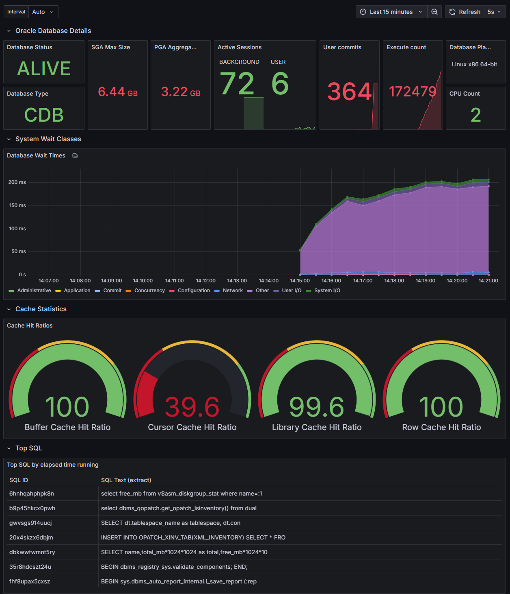

# Unified Observability for Oracle Database

This project aims to provide observability for the Oracle Database so that users can understand performance and diagnose issues easily across applications and database.  Over time, this project will provide not just metrics, but also logging and tracing support, and integration into popular frameworks like Spring Boot.  The project aims to deliver functionality to support both cloud and on-premises databases, including those running in Kubernetes and containers.

## Main Features

The main features of the exporter are:

- Exports Oracle Database metrics in de facto standard Prometheus format
- Works with many types of Oracle Database deployment including single instance and Oracle Autonomous Database
- Supports wallet-based authentication
- Supports both OCI and Azure Vault integration (for database username, password)
- Multiple database support allows a single instance of the exporter to connect to, and export metrics from, multiple databases
- Can export the Alert Log in JSON format for easy ingest by log aggregators
- Can run as a local binary, in a container, or in Kubernetes
- Pre-buit AMD64 and ARM64 images provided
- A set of standard metrics included "out of the box"
- Easily define custom metrics
- Define the scrape interval, down to a per-metric level
- Define the query timeout
- Control connection pool settings, can use with go-sql or Oracle Database connection pools, also works with Database Resident Connection Pools
- Sample dashboard provided for Grafana



From the first production release, v1.0, onwards, this project provides a [Prometheus](https://prometheus.io/) exporter for Oracle Database that is based in part on a Prometheus exporter created by [Seth Miller](https://github.com/iamseth/oracledb_exporter) with changes to comply with various Oracle standards and policies.

> Seth has archived his exporter as of Feb 13, 2025 and added a note encouraging people to check out ours instead.  We wanted to extend a huge "Thank You!" to Seth for all the work he did on that exporter, and his contributions to the Oracle and open source communities!

Contributions are welcome - please see [contributing](CONTRIBUTING.md).

## Table of Contents


* [Unified Observability for Oracle Database](#unified-observability-for-oracle-database)
  * [Main Features](#main-features)
  * [Table of Contents](#table-of-contents)
  * [Releases](#releases)
  * [Roadmap](#roadmap)
  * [Standard metrics](#standard-metrics)
  * [Database permissions required](#database-permissions-required)
  * [Alert logs](#alert-logs)
  * [Installation](#installation)
    * [Docker, Podman, etc](#docker-podman-etc)
      * [Oracle Database](#oracle-database)
      * [Exporter](#exporter)
        * [Simple connection](#simple-connection)
        * [Using a wallet](#using-a-wallet)
    * [Test/demo environment with Docker Compose](#testdemo-environment-with-docker-compose)
    * [Kubernetes](#kubernetes)
      * [Create a secret with credentials for connecting to the Oracle Database](#create-a-secret-with-credentials-for-connecting-to-the-oracle-database)
      * [Create a config map for the exporter configuration file (recommended)](#create-a-config-map-for-the-exporter-configuration-file-recommended)
      * [Create a config map for the wallet (optional)](#create-a-config-map-for-the-wallet-optional)
      * [Create a config map for your metrics definition file (optional)](#create-a-config-map-for-your-metrics-definition-file-optional)
      * [Deploy the Oracle Database Observability exporter](#deploy-the-oracle-database-observability-exporter)
      * [Create a Kubernetes service for the exporter](#create-a-kubernetes-service-for-the-exporter)
      * [Create a Kubernetes service monitor](#create-a-kubernetes-service-monitor)
      * [Configure a Prometheus target (optional)](#configure-a-prometheus-target-optional)
      * [Import Grafana dashboard definition(s) (optional)](#import-grafana-dashboard-definitions-optional)
    * [Standalone binary](#standalone-binary)
    * [Scraping multiple databases](#scraping-multiple-databases)
      * [Configuring connections for multiple databases using Oracle Database wallet(s)](#configuring-connections-for-multiple-databases-using-oracle-database-wallets)
      * [Scraping metrics from specific databases](#scraping-metrics-from-specific-databases)
    * [Using OCI Vault](#using-oci-vault)
      * [OCI Vault CLI Configuration](#oci-vault-cli-configuration)
    * [Using Azure Vault](#using-azure-vault)
      * [Azure Vault CLI Configuration](#azure-vault-cli-configuration)
      * [Authentication](#authentication)
  * [Custom metrics](#custom-metrics)
    * [Customize metrics in a container image](#customize-metrics-in-a-container-image)
  * [Controlling memory usage](#controlling-memory-usage)
  * [Grafana dashboards](#grafana-dashboards)
  * [Monitoring Transactional Event Queues](#monitoring-transactional-event-queues)
    * [How to create some traffic with PL/SQL](#how-to-create-some-traffic-with-plsql)
    * [How to create some traffic with Java (Spring Boot)](#how-to-create-some-traffic-with-java-spring-boot)
    * [Metrics definitions](#metrics-definitions)
    * [Additional database permissions](#additional-database-permissions)
    * [Grafana dashboard](#grafana-dashboard)
  * [Developer notes](#developer-notes)
    * [Docker/container build](#dockercontainer-build)
    * [Building Binaries](#building-binaries)
  * [Contributing](#contributing)
  * [Security](#security)
  * [License](#license)

## Releases

| Release | Date                 | Changelog                                                       |
|---------|----------------------|-----------------------------------------------------------------|
| 2.0.1   | June 12, 2025        | [2.0.1 Changelog](./changelog.md#version-201-june-12-2025)      |
| 2.0.0   | May 27, 2025         | [2.0.0 Changelog](./changelog.md#version-200-may-27-2025)       |
| 1.6.1   | May 2, 2025          | [1.6.1 Changelog](./changelog.md#version-161-may-2-2025)        |
| 1.6.0   | April 18, 2025       | [1.6.0 Changelog](./changelog.md#version-160-april-18-2025)     |
| 1.5.5   | March 13th, 2025     | [1.5.5 Changelog](./changelog.md#version-155-march-13-2025)     |
| 1.5.4   | March 3rd, 2025      | [1.5.4 Changelog](./changelog.md#version-154-march-3-2025)      |
| 1.5.3   | January 28th, 2025   | [1.5.3 Changelog](./changelog.md#version-153-january-28-2025)   |
| 1.5.2   | December 2nd, 2024   | [1.5.2 Changelog](./changelog.md#version-152-december-2-2024)   |
| 1.5.1   | October 28th, 2024   | [1.5.1 Changelog](./changelog.md#version-151-october-28-2024)   |
| 1.5.0   | September 26th, 2024 | [1.5.0 Changelog](./changelog.md#version-150-september-26-2024) |

For releases notes on older releases, see the [Changelog](./changelog.md)

## Roadmap

We always welcome input on features you would like to see supported.  Please open an issue in this repository with your suggestions.

Currently, we plan to address the following key features:

- Implement support for RAC - allow the exporter to collect metrics for instances in a RAC cluster,
- Implement connection storm protection - prevent the exporter from repeatedly connecting when the credentials fail, to prevent a storm of connections causing accounts to be locked across a large number of databases,
- Provide the option to have the Oracle client outside of the container image, e.g., on a shared volume,
- Implement the ability to update the configuration dynamically, i.e., without a restart,
- Implement support for tracing within the database, e.g., using an execution context ID provide by an external caller,
- Provide additional pre-built Grafana dashboards,
- Integration with Spring Observability, e.g., Micrometer, and 
- Provide additional documentation and samples.

## Standard metrics

The following metrics are exposed by default:

```text
# HELP oracledb_activity_execute_count Generic counter metric from gv$sysstat view in Oracle.
# TYPE oracledb_activity_execute_count gauge
oracledb_activity_execute_count 64469
# HELP oracledb_activity_parse_count_total Generic counter metric from gv$sysstat view in Oracle.
# TYPE oracledb_activity_parse_count_total gauge
oracledb_activity_parse_count_total 25883
# HELP oracledb_activity_user_commits Generic counter metric from gv$sysstat view in Oracle.
# TYPE oracledb_activity_user_commits gauge
oracledb_activity_user_commits 158
# HELP oracledb_activity_user_rollbacks Generic counter metric from gv$sysstat view in Oracle.
# TYPE oracledb_activity_user_rollbacks gauge
oracledb_activity_user_rollbacks 2
# HELP oracledb_db_platform_value Database platform
# TYPE oracledb_db_platform_value gauge
oracledb_db_platform_value{platform_name="Linux x86 64-bit"} 1
# HELP oracledb_db_system_value Database system resources metric
# TYPE oracledb_db_system_value gauge
oracledb_db_system_value{name="cpu_count"} 2
oracledb_db_system_value{name="pga_aggregate_limit"} 2.147483648e+09
oracledb_db_system_value{name="sga_max_size"} 1.610612736e+09
# HELP oracledb_dbtype Type of database the exporter is connected to (0=non-CDB, 1=CDB, >1=PDB).
# TYPE oracledb_dbtype gauge
oracledb_dbtype 0
# HELP oracledb_exporter_build_info A metric with a constant '1' value labeled by version, revision, branch, goversion from which oracledb_exporter was built, and the goos and goarch for the build.
# TYPE oracledb_exporter_build_info gauge
oracledb_exporter_build_info{branch="",goarch="amd64",goos="linux",goversion="go1.22.4",revision="unknown",tags="unknown",version=""} 1
# HELP oracledb_exporter_last_scrape_duration_seconds Duration of the last scrape of metrics from Oracle DB.
# TYPE oracledb_exporter_last_scrape_duration_seconds gauge
oracledb_exporter_last_scrape_duration_seconds 0.040507382
# HELP oracledb_exporter_last_scrape_error Whether the last scrape of metrics from Oracle DB resulted in an error (1 for error, 0 for success).
# TYPE oracledb_exporter_last_scrape_error gauge
oracledb_exporter_last_scrape_error 0
# HELP oracledb_exporter_scrapes_total Total number of times Oracle DB was scraped for metrics.
# TYPE oracledb_exporter_scrapes_total counter
oracledb_exporter_scrapes_total 3
# HELP oracledb_process_count Gauge metric with count of processes.
# TYPE oracledb_process_count gauge
oracledb_process_count 79
# HELP oracledb_resource_current_utilization Generic counter metric from gv$resource_limit view in Oracle (current value).
# TYPE oracledb_resource_current_utilization gauge
oracledb_resource_current_utilization{resource_name="branches"} 0
oracledb_resource_current_utilization{resource_name="cmtcallbk"} 0
oracledb_resource_current_utilization{resource_name="dml_locks"} 0
oracledb_resource_current_utilization{resource_name="enqueue_locks"} 43
oracledb_resource_current_utilization{resource_name="enqueue_resources"} 31
oracledb_resource_current_utilization{resource_name="gcs_resources"} 0
oracledb_resource_current_utilization{resource_name="gcs_shadows"} 0
oracledb_resource_current_utilization{resource_name="ges_big_msgs"} 0
oracledb_resource_current_utilization{resource_name="ges_cache_ress"} 0
oracledb_resource_current_utilization{resource_name="ges_locks"} 0
oracledb_resource_current_utilization{resource_name="ges_procs"} 0
oracledb_resource_current_utilization{resource_name="ges_reg_msgs"} 0
oracledb_resource_current_utilization{resource_name="ges_ress"} 0
oracledb_resource_current_utilization{resource_name="ges_rsv_msgs"} 0
oracledb_resource_current_utilization{resource_name="k2q_locks"} 0
oracledb_resource_current_utilization{resource_name="max_rollback_segments"} 22
oracledb_resource_current_utilization{resource_name="max_shared_servers"} 2
oracledb_resource_current_utilization{resource_name="parallel_max_servers"} 2
oracledb_resource_current_utilization{resource_name="processes"} 80
oracledb_resource_current_utilization{resource_name="sessions"} 95
oracledb_resource_current_utilization{resource_name="smartio_buffer_memory"} 0
oracledb_resource_current_utilization{resource_name="smartio_metadata_memory"} 0
oracledb_resource_current_utilization{resource_name="smartio_overhead_memory"} 0
oracledb_resource_current_utilization{resource_name="smartio_sessions"} 0
oracledb_resource_current_utilization{resource_name="sort_segment_locks"} 2
oracledb_resource_current_utilization{resource_name="temporary_table_locks"} 0
oracledb_resource_current_utilization{resource_name="transactions"} 0
# HELP oracledb_resource_limit_value Generic counter metric from gv$resource_limit view in Oracle (UNLIMITED: -1).
# TYPE oracledb_resource_limit_value gauge
oracledb_resource_limit_value{resource_name="branches"} -1
oracledb_resource_limit_value{resource_name="cmtcallbk"} -1
oracledb_resource_limit_value{resource_name="dml_locks"} -1
oracledb_resource_limit_value{resource_name="enqueue_locks"} 5542
oracledb_resource_limit_value{resource_name="enqueue_resources"} -1
oracledb_resource_limit_value{resource_name="gcs_resources"} -1
oracledb_resource_limit_value{resource_name="gcs_shadows"} -1
oracledb_resource_limit_value{resource_name="ges_big_msgs"} -1
oracledb_resource_limit_value{resource_name="ges_cache_ress"} -1
oracledb_resource_limit_value{resource_name="ges_locks"} -1
oracledb_resource_limit_value{resource_name="ges_procs"} 0
oracledb_resource_limit_value{resource_name="ges_reg_msgs"} -1
oracledb_resource_limit_value{resource_name="ges_ress"} -1
oracledb_resource_limit_value{resource_name="ges_rsv_msgs"} 0
oracledb_resource_limit_value{resource_name="k2q_locks"} -1
oracledb_resource_limit_value{resource_name="max_rollback_segments"} 65535
oracledb_resource_limit_value{resource_name="max_shared_servers"} -1
oracledb_resource_limit_value{resource_name="parallel_max_servers"} 32767
oracledb_resource_limit_value{resource_name="processes"} 300
oracledb_resource_limit_value{resource_name="sessions"} 472
oracledb_resource_limit_value{resource_name="smartio_buffer_memory"} -1
oracledb_resource_limit_value{resource_name="smartio_metadata_memory"} -1
oracledb_resource_limit_value{resource_name="smartio_overhead_memory"} -1
oracledb_resource_limit_value{resource_name="smartio_sessions"} -1
oracledb_resource_limit_value{resource_name="sort_segment_locks"} -1
oracledb_resource_limit_value{resource_name="temporary_table_locks"} -1
oracledb_resource_limit_value{resource_name="transactions"} -1
# HELP oracledb_sessions_value Gauge metric with count of sessions by status and type.
# TYPE oracledb_sessions_value gauge
oracledb_sessions_value{status="ACTIVE",type="BACKGROUND"} 65
oracledb_sessions_value{status="ACTIVE",type="USER"} 7
oracledb_sessions_value{status="INACTIVE",type="USER"} 1
# HELP oracledb_tablespace_bytes Generic counter metric of tablespaces bytes in Oracle.
# TYPE oracledb_tablespace_bytes gauge
oracledb_tablespace_bytes{tablespace="SYSAUX",type="PERMANENT"} 5.7442304e+08
oracledb_tablespace_bytes{tablespace="SYSTEM",type="PERMANENT"} 1.101135872e+09
oracledb_tablespace_bytes{tablespace="TEMP",type="TEMPORARY"} 0
oracledb_tablespace_bytes{tablespace="UNDOTBS1",type="UNDO"} 4.1353216e+07
oracledb_tablespace_bytes{tablespace="USERS",type="PERMANENT"} 1.048576e+06
# HELP oracledb_tablespace_free Generic counter metric of tablespaces free bytes in Oracle.
# TYPE oracledb_tablespace_free gauge
oracledb_tablespace_free{tablespace="SYSAUX",type="PERMANENT"} 1.7939390464e+10
oracledb_tablespace_free{tablespace="SYSTEM",type="PERMANENT"} 1.7936965632e+10
oracledb_tablespace_free{tablespace="TEMP",type="TEMPORARY"} 1.7947820032e+10
oracledb_tablespace_free{tablespace="UNDOTBS1",type="UNDO"} 3.4318368768e+10
oracledb_tablespace_free{tablespace="USERS",type="PERMANENT"} 1.7930805248e+10
# HELP oracledb_tablespace_max_bytes Generic counter metric of tablespaces max bytes in Oracle.
# TYPE oracledb_tablespace_max_bytes gauge
oracledb_tablespace_max_bytes{tablespace="SYSAUX",type="PERMANENT"} 1.8513813504e+10
oracledb_tablespace_max_bytes{tablespace="SYSTEM",type="PERMANENT"} 1.9038101504e+10
oracledb_tablespace_max_bytes{tablespace="TEMP",type="TEMPORARY"} 1.7947820032e+10
oracledb_tablespace_max_bytes{tablespace="UNDOTBS1",type="UNDO"} 3.4359721984e+10
oracledb_tablespace_max_bytes{tablespace="USERS",type="PERMANENT"} 1.7931853824e+10
# HELP oracledb_tablespace_used_percent Gauge metric showing as a percentage of how much of the tablespace has been used.
# TYPE oracledb_tablespace_used_percent gauge
oracledb_tablespace_used_percent{tablespace="SYSAUX",type="PERMANENT"} 3.102672714489066
oracledb_tablespace_used_percent{tablespace="SYSTEM",type="PERMANENT"} 5.783853352019611
oracledb_tablespace_used_percent{tablespace="TEMP",type="TEMPORARY"} 0
oracledb_tablespace_used_percent{tablespace="UNDOTBS1",type="UNDO"} 0.1203537561196118
oracledb_tablespace_used_percent{tablespace="USERS",type="PERMANENT"} 0.005847560493698568
# HELP oracledb_teq_curr_inst_id ID of current instance
# TYPE oracledb_teq_curr_inst_id gauge
oracledb_teq_curr_inst_id 1
# HELP oracledb_top_sql_elapsed SQL statement elapsed time running
# TYPE oracledb_top_sql_elapsed gauge
oracledb_top_sql_elapsed{sql_id="01uy9sb7w8a9g",sql_text=" begin      dbms_aqadm_sys.remove_all_nondurablesub(:1,"} 0.147496
oracledb_top_sql_elapsed{sql_id="0nakmm882vmq0",sql_text="select /* QOSH:DROP_STAT_HIST_PARTS */ partition_name, "} 0.072836
oracledb_top_sql_elapsed{sql_id="0sbbcuruzd66f",sql_text="select /*+ rule */ bucket_cnt, row_cnt, cache_cnt, null"} 0.072226
oracledb_top_sql_elapsed{sql_id="121ffmrc95v7g",sql_text="select i.obj#,i.ts#,i.file#,i.block#,i.intcols,i.type#,"} 0.17176
oracledb_top_sql_elapsed{sql_id="20x4skzx6dbjm",sql_text="INSERT INTO OPATCH_XINV_TAB(XML_INVENTORY) SELECT * FRO"} 2.656821
oracledb_top_sql_elapsed{sql_id="3un99a0zwp4vd",sql_text="select owner#,name,namespace,remoteowner,linkname,p_tim"} 0.069393
oracledb_top_sql_elapsed{sql_id="3wrrjm9qtr2my",sql_text="SELECT T.CLIENT_ID,         T.OPERATION_ID,         T.T"} 0.309885
oracledb_top_sql_elapsed{sql_id="44dn40afubks4",sql_text="select decode(u.type#, 2, u.ext_username, u.name), o.na"} 0.098865
oracledb_top_sql_elapsed{sql_id="586577qpbkgnk",sql_text="select 1 from DBA_SCHEDULER_JOBS  where JOB_NAME like '"} 0.072079
oracledb_top_sql_elapsed{sql_id="5yutdqf5nvrmt",sql_text="SELECT     dt.tablespace_name as tablespace,     dt.con"} 0.081922
oracledb_top_sql_elapsed{sql_id="8gbt6t0s3jn0t",sql_text="MERGE /*+ OPT_PARAM('_parallel_syspls_obey_force' 'fals"} 0.068104
oracledb_top_sql_elapsed{sql_id="b9c6ffh8tc71f",sql_text="BEGIN dbms_output.enable(NULL); END;"} 0.0982
oracledb_top_sql_elapsed{sql_id="cz8wbmy7k5bxn",sql_text="begin sys.dbms_aq_inv.internal_purge_queue_table(:1, :2"} 0.181691
# HELP oracledb_up Whether the Oracle database server is up.
# TYPE oracledb_up gauge
oracledb_up 1
# HELP oracledb_wait_time_administrative counter metric from system_wait_class view in Oracle.
# TYPE oracledb_wait_time_administrative counter
oracledb_wait_time_administrative 0
# HELP oracledb_wait_time_application counter metric from system_wait_class view in Oracle.
# TYPE oracledb_wait_time_application counter
oracledb_wait_time_application 0.03
# HELP oracledb_wait_time_cluster counter metric from system_wait_class view in Oracle.
# TYPE oracledb_wait_time_cluster counter
oracledb_wait_time_cluster 0
# HELP oracledb_wait_time_commit counter metric from system_wait_class view in Oracle.
# TYPE oracledb_wait_time_commit counter
oracledb_wait_time_commit 0.04
# HELP oracledb_wait_time_concurrency counter metric from system_wait_class view in Oracle.
# TYPE oracledb_wait_time_concurrency counter
oracledb_wait_time_concurrency 0.56
# HELP oracledb_wait_time_configuration counter metric from system_wait_class view in Oracle.
# TYPE oracledb_wait_time_configuration counter
oracledb_wait_time_configuration 0.15
# HELP oracledb_wait_time_network counter metric from system_wait_class view in Oracle.
# TYPE oracledb_wait_time_network counter
oracledb_wait_time_network 0
# HELP oracledb_wait_time_other counter metric from system_wait_class view in Oracle.
# TYPE oracledb_wait_time_other counter
oracledb_wait_time_other 16.44
# HELP oracledb_wait_time_scheduler counter metric from system_wait_class view in Oracle.
# TYPE oracledb_wait_time_scheduler counter
oracledb_wait_time_scheduler 0.59
# HELP oracledb_wait_time_system_io counter metric from system_wait_class view in Oracle.
# TYPE oracledb_wait_time_system_io counter
oracledb_wait_time_system_io 1.62
# HELP oracledb_wait_time_user_io counter metric from system_wait_class view in Oracle.
# TYPE oracledb_wait_time_user_io counter
oracledb_wait_time_user_io 24.5
```

These standard metrics are defined in the file `default-metrics.toml` found in the root directory of this repository. 

> **Note:** You can change the interval at which metrics are collected at a per-metric level.  If you find that any of the default metrics are placing too much load on your database instance, you may will too collect that particular metric less often, which can be done by adding the `scrapeinterval` paraemeter to the metric definition.  See the definition of the `top_sql` metric for an example.


## Database permissions required

For the built-in default metrics, the database user that the exporter uses to connect to the Oracle Database instance must have the `SELECT_CATALOG_ROLE` privilege and/or `SELECT` permission on the following objects:

- dba_tablespace_usage_metrics
- dba_tablespaces
- gv$system_wait_class
- gv$asm_diskgroup_stat
- gv$datafile
- gv$sysstat
- gv$process
- gv$waitclassmetric
- gv$session
- gv$resource_limit
- gv$parameter
- gv$database
- gv$sqlstats
- gv$sysmetric
- v$diag_alert_ext (for alert logs only)

## Alert logs

The exporter can export alert log records into a file that is suitable for collection by a log ingestion tool like Promtail or FluentBit.

You can specify the interval that log records should be published using the parameter `log.interval` using a GoLang duration
string.  A duration string is a possibly signed sequence of decimal numbers, each with optional fraction and a unit suffix,
such as "300ms", "-1.5h" or "2h45m". Valid time units are "ns", "us" (or "µs"), "ms", "s", "m", "h", "d", "w", "y".

You can specify the location of the output log file using the environment variable `LOG_DESTINATION`.
The default is `/log/alert.log`.  If you are running in Kubernetes, you should mount a volume
on `/log` so that it can be accessed by both the exporter container and your log collector container.

The output is formatted as one JSON record per line, which most log collection tools will be able to parse with minimal configuration.

Here is an example of the output:

```log
{"timestamp":"2023-09-02T05:40:43.626Z","moduleId":"","ecid":"","message":"Starting ORACLE instance (restrict) (OS id: 1473)"}
{"timestamp":"2023-09-02T05:40:43.64Z","moduleId":"","ecid":"","message":"****************************************************"}
{"timestamp":"2023-09-02T05:40:43.64Z","moduleId":"","ecid":"","message":" Sys-V shared memory will be used for creating SGA "}
{"timestamp":"2023-09-02T05:40:43.64Z","moduleId":"","ecid":"","message":" ****************************************************"}
{"timestamp":"2023-09-02T05:40:43.641Z","moduleId":"","ecid":"","message":"**********************************************************************"}
{"timestamp":"2023-09-02T05:40:43.641Z","moduleId":"","ecid":"","message":"Dump of system resources acquired for SHARED GLOBAL AREA (SGA) "}
{"timestamp":"2023-09-02T05:40:43.642Z","moduleId":"","ecid":"","message":" Domain name: kubepods.slice/kubepods-besteffort.slice/kubepods-besteffort-poda2061467_5334_40c3_9328_71be8196ee89.slice/crio-09918aac8159cea"}
{"timestamp":"2023-09-02T05:40:43.642Z","moduleId":"","ecid":"","message":" Per process system memlock (soft) limit = 64K"}
{"timestamp":"2023-09-02T05:40:43.642Z","moduleId":"","ecid":"","message":" Expected per process system memlock (soft) limit to lock"}
{"timestamp":"2023-09-02T05:40:43.642Z","moduleId":"","ecid":"","message":" instance MAX SHARED GLOBAL AREA (SGA) into memory: 1532M"}
{"timestamp":"2023-09-02T05:40:43.643Z","moduleId":"","ecid":"","message":" Available system pagesizes:"}
{"timestamp":"2023-09-02T05:40:43.643Z","moduleId":"","ecid":"","message":"  4K, 2048K "}
{"timestamp":"2023-09-02T05:40:43.643Z","moduleId":"","ecid":"","message":" Supported system pagesize(s):"}
{"timestamp":"2023-09-02T05:40:43.643Z","moduleId":"","ecid":"","message":"  PAGESIZE  AVAILABLE_PAGES  EXPECTED_PAGES  ALLOCATED_PAGES  ERROR(s)"}
{"timestamp":"2023-09-02T05:40:43.644Z","moduleId":"","ecid":"","message":"        4K       Configured               5           391529        NONE"}
{"timestamp":"2023-09-02T05:40:43.644Z","moduleId":"","ecid":"","message":"     2048K                0             766                0        NONE"}
```

You may disable alert logs by setting the parameter `log.disable` to `1`.

## Installation

There are a number of ways to run the exporter.  In this section you will find information on running the exporter:

- In a container runtime like [Docker, Podman, etc](#docker-podman-etc)
- In a test/demo environment using [Docker Compose](#testdemo-environment-with-docker-compose)
- In [Kubernetes](#kubernetes)
- As a [standalone binary](#standalone-binary)

### Docker, Podman, etc

You can run the exporter in a local container using a container image from [Oracle Container Registry](https://container-registry.oracle.com).  The container image is available in the "observability-exporter" repository in the "Database" category.  No authentication or license presentment/acceptance are required to pull this image from the registry.

#### Oracle Database

If you need an Oracle Database to test the exporter, you can use this command to start up an instance of [Oracle Database 23ai Free](https://www.oracle.com/database/free/) which also requires no authentication or license presentment/acceptance to pull the image.

```bash
docker run --name free23ai \
    -d \
    -p 1521:1521 \
    -e ORACLE_PASSWORD=Welcome12345 \
    gvenzl/oracle-free:23.6-slim-faststart
```

This will pull the image and start up the database with a listener on port 1521. It will also create a pluggable database (a database container) called "FREEPDB1" and will set the admin passwords to the password you specified on this command.

You can tail the logs to see when the database is ready to use:

```bash
docker logs -f free23ai

(look for this message...)
#########################
DATABASE IS READY TO USE!
#########################
```

To obtain the IP address of the container, which you will need to connect to the database, use this command.  Note: depending on your platform and container runtime, you may be able to access the database at "localhost":

```bash
docker inspect free23ai | grep IPA
    "SecondaryIPAddresses": null,
    "IPAddress": "172.17.0.2",
            "IPAMConfig": null,
            "IPAddress": "172.17.0.2",
```

#### Exporter

You need to give the exporter the connection details for the Oracle Database that you want it to run against.  You can use a simple connection, or a wallet.

##### Simple connection

For a simple connection, you will provide the details using these variables:

- `DB_USERNAME` is the database username, e.g., `pdbadmin`
- `DB_PASSWORD` is the password for that user, e.g., `Welcome12345`
- `DB_CONNECT_STRING` is the connection string, e.g., `free23ai:1521/freepdb`
- `DB_ROLE` (Optional) can be set to `SYSDBA`, `SYSOPER`, `SYSBACKUP`, `SYSDG`, `SYSKM`, `SYSRAC` or `SYSASM` if you want to connect with one of those roles, however Oracle recommends that you connect with the lowest possible privileges and roles necessary for the exporter to run.

To run the exporter in a container and expose the port, use a command like this, with the appropriate values for the environment variables:

```bash
docker run -it --rm \
    -e DB_USERNAME=pdbadmin \
    -e DB_PASSWORD=Welcome12345 \
    -e DB_CONNECT_STRING=free23ai:1521/freepdb \
    -p 9161:9161 \
    container-registry.oracle.com/database/observability-exporter:2.0.1
```

##### Using a wallet

For a **mTLS connection**, you must first set up the wallet.  If you are using Oracle Autonomous Database with mTLS, for example, you can download the wallet from the Oracle Cloud Infrastructure (OCI) console.  

1. Unzip the wallet into a new directory, e.g., called `wallet`.
1. Edit the `sqlnet.ora` file and set the `DIRECTORY` to `/wallet`.  This is the path inside the exporter container where you will provide the wallet.
1. Take a note of the TNS Alias name from the `tnsnames.ora` that will be used to connect to the database, e.g., `devdb_tp`.

To use a **wallet for authentication**, use `orapki` to create a wallet and secretstore.  The `orapki` utility can be found in SQLcl or in full database techstack installations.
1. Create a wallet, for example: 
    ```bash
    orapki wallet create -wallet /wallet -auto_login -pwd <wallet_password>
    ```
1. Create a secretstore for the database user, specifying the TNS Alias name (`<tns_alias>`) from the `tnsnames.ora` file for example: 
    ```bash
    orapki secretstore create_credential -wallet /wallet -pwd <wallet_password> -connect_string <tns_alias> -username <db_user_name> -password <db_user_password>
    ```
1. Add the following lines to the `sqlnet.ora` file:
    ```text
    WALLET_LOCATION = (SOURCE=(METHOD=FILE)(METHOD_DATA=(DIRECTORY=/wallet)))
    SQLNET.WALLET_OVERRIDE = TRUE
    ```

Now, you provide the connection details using these variables:

- `DB_USERNAME` is the database username, e.g., `pdbadmin` **Note:** Do not set `DB_USERNAME` if using wallet authentication
- `DB_PASSWORD` is the password for that user, e.g., `Welcome12345` **Note:** Do not set `DB_PASSWORD` if using wallet authentication
- `DB_CONNECT_STRING` is the connection string, e.g., `devdb_tp`
- `DB_ROLE` (Optional) can be set to `SYSDBA` or `SYSOPER` if you want to connect with one of those roles, however Oracle recommends that you connect with the lowest possible privileges and roles necessary for the exporter to run.
- `ORACLE_HOME` is the location of the Oracle Instant Client, i.e., `/lib/oracle/21/client64/lib`.  If you built your own container image, the path may be different.
- `TNS_ADMIN` is the location of your (unzipped) wallet.  The `DIRECTORY` set in the `sqlnet.ora` file must match the path that it will be mounted on inside the container.

> **Note:** Specify the path to your wallet using the `TNS_ADMIN` environment variable rather than adding it to the `DB_CONNECT_STRING`.

To run the exporter in a container and expose the port, use a command like this, with the appropriate values for the environment variables, and mounting your `wallet` directory as `/wallet` in the container to provide access to the wallet:

```bash
docker run -it --rm \
    -e DB_USERNAME=pdbadmin \
    -e DB_PASSWORD=Welcome12345 \
    -e DB_CONNECT_STRING=devdb_tp \
    -v ./wallet:/wallet \
    -p 9161:9161 \
    container-registry.oracle.com/database/observability-exporter:2.0.1
```
> **Note:** If you are using `podman` you must specify the `:z` suffix on the volume mount so that the container will be able to access the files in the volume.  For example: `-v ./wallet:/wallet:z`

### Test/demo environment with Docker Compose

If you would like to set up a test environment with the exporter, you can use the provided "Docker Compose" file in this repository which will start an Oracle Database instance, the exporter, Prometheus and Grafana.

```bash
cd docker-compose
docker-compose up -d
```

The containers will take a short time to start.  The first time, the Oracle container might take a few minutes to start while it creates the database instance, but this is a one-time operation, and subequent restarts will be much faster (a few seconds).

Once the containers are all running, you can access the services using these URLs:

- [Exporter](http://localhost:9161/metrics)
- [Prometheus](http://localhost:9090) - try a query for "oracle".
- [Grafana](http://localhost:3000) - username is "admin" and password is "grafana".  An Oracle Database dashboard is provisioned and configured to use data from the exporter.

### Kubernetes

To run the exporter in Kubernetes, you need to complete the following steps.  All steps must be completed in the same Kunernetes namespace.  The examples below assume you want to use a namespace called `exporter`, you must change the commands if you wish to use a different namespace.

#### Create a secret with credentials for connecting to the Oracle Database

Create a secret with the Oracle database user and password that the exporter should use to connect to the database using this command.  You must specify the correct user and password for your environment.  This example uses `pdbadmin` as the user and `Welcome12345` as the password:

```bash
kubectl create secret generic db-secret \
    --from-literal=username=pdbadmin \
    --from-literal=password=Welcome12345 \
    -n exporter
```

#### Create a config map for the exporter configuration file (recommended)

Create a config map with the exporter configuration file (if you are using one) using this command: 

```bash
kubectl create cm metrics-exporter-config \
    --from-file=metrics-exporter-config.yaml
```

> NOTE: It is strongly recommended to migrate to the new config file if you are running version 2.0.0 or later.


#### Create a config map for the wallet (optional)

Create a config map with the wallet (if you are using one) using this command.  Run this command in the `wallet` directory you created earlier.

```bash
kubectl create cm db-metrics-tns-admin \
    --from-file=cwallet.sso \
    --from-file=ewallet.p12 \
    --from-file=ewallet.pem \
    --from-file=keystore.jks \
    --from-file=ojdbc.properties \
    --from-file=sqlnet.ora \
    --from-file=tnsnames.ora \
    --from-file=truststore.jks \
    -n exporter
```

#### Create a config map for your metrics definition file (optional)

If you have defined any [custom metrics](#custom-metrics), you must create a config map for the metrics definition file.  For example, if you created a configuration file called `txeventq-metrics.toml`, then create the config map with this command:

```bash
kubectl create cm db-metrics-txeventq-exporter-config \
    --from-file=txeventq-metrics.toml \
    -n exporter
```

#### Deploy the Oracle Database Observability exporter

A sample Kubernetes manifest is provided [here](/kubernetes/metrics-exporter-deployment.yaml).  You must edit this file to set the namespace you wish to use, the database connect string to use, and if you have any custom metrics, you will need to uncomment and customize some sections in this file.

Once you have made the necessary updates, apply the file to your cluster using this command:

```bash
kubectl apply -f metrics-exporter-deployment.yaml
```

You can check the deployment was successful and monitor the exporter startup with this command:

```bash
kubectl get pods -n exporter -w
```

You can view the exporter's logs with this command:

```bash
kubectl logs -f svc/metrics-exporter -n exporter
```

#### Create a Kubernetes service for the exporter

Create a Kubernetes service to allow access to the exporter pod(s).  A sample Kubernetes manifest is provided [here](/kubernetes/metrics-exporter-service.yaml).  You may need to customize this file to update the namespace.

Once you have made any necessary udpates, apply the file to your cluster using this command:

```bash
kubectl apply -f metrics-exporter-service.yaml
```

#### Create a Kubernetes service monitor

Create a Kubernetes service monitor to tell Prometheus (for example) to collect metrics from the exporter.  A sample Kubernetes manifest is provided [here](/kubernetes/metrics-service-monitor.yaml).  You may need to customize this file to update the namespace.

Once you have made any necessary udpates, apply the file to your cluster using this command:

```bash
kubectl apply -f metrics-service-monitor.yaml
```

#### Configure a Prometheus target (optional)

You may need to update your Prometheus configuration to add a target.  If so, you can use this example job definition as a guide:

```yaml
  - job_name: 'oracle-exporter'
    metrics_path: '/metrics'
    scrape_interval: 15s
    scrape_timeout: 10s
    static_configs:
    - targets: 
      - metrics-exporter.exporter.svc.cluster.local:9161
```

#### Import Grafana dashboard definition(s) (optional)

See [Grafana dashboards](#grafana-dashboards) below.

### Standalone binary

Pre-compiled versions for Linux, ARM and Darwin 64-bit can be found under [releases](https://github.com/oracle/oracle-db-appdev-monitoring/releases).

In order to run, you'll need the [Oracle Instant Client Basic](http://www.oracle.com/technetwork/database/features/instant-client/index-097480.html) for your operating system. Only the basic version is required for the exporter.

> NOTE: If you are running the Standalone binary on a Mac ARM platform you must set the variable `DYLD_LIBRARY_PATH` to the location of where the instant client installed. For example `export DYLD_LIBRARY_PATH=/lib/oracle/instantclient_23_3`.

The following command line arguments (flags) can be passed to the exporter (the --help flag will show the table below).

```bash
Usage of oracledb_exporter:
      --config.file="example-config.yaml"
                                 File with metrics exporter configuration.  (env: CONFIG_FILE)
      --web.telemetry-path="/metrics"
                                 Path under which to expose metrics. (env: TELEMETRY_PATH)
      --default.metrics="default-metrics.toml"
                                 File with default metrics in a TOML file. (env: DEFAULT_METRICS)
      --custom.metrics=""        Comma separated list of file(s) that contain various custom metrics in a TOML format. (env: CUSTOM_METRICS)
      --query.timeout=5          Query timeout (in seconds). (env: QUERY_TIMEOUT)
      --database.maxIdleConns=0  Number of maximum idle connections in the connection pool. (env: DATABASE_MAXIDLECONNS)
      --database.maxOpenConns=10
                                 Number of maximum open connections in the connection pool. (env: DATABASE_MAXOPENCONNS)
      --database.poolIncrement=-1
                                 Connection increment when the connection pool reaches max capacity. (env: DATABASE_POOLINCREMENT)
      --database.poolMaxConnections=-1
                                 Maximum number of connections in the connection pool. (env: DATABASE_POOLMAXCONNECTIONS)
      --database.poolMinConnections=-1
                                 Minimum number of connections in the connection pool. (env: DATABASE_POOLMINCONNECTIONS)
      --scrape.interval=0s       Interval between each scrape. Default is to scrape on collect requests.
      --log.disable=0            Set to 1 to disable alert logs
      --log.interval=15s         Interval between log updates (e.g. 5s).
      --log.destination="/log/alert.log"
                                 File to output the alert log to. (env: LOG_DESTINATION)
      --web.listen-address=:9161 ...
                                 Addresses on which to expose metrics and web interface. Repeatable for multiple addresses. Examples: `:9100` or `[::1]:9100` for http, `vsock://:9100` for vsock
      --web.config.file=""       Path to configuration file that can enable TLS or authentication. See: https://github.com/prometheus/exporter-toolkit/blob/master/docs/web-configuration.md
      --log.level=info           Only log messages with the given severity or above. One of: [debug, info, warn, error]
      --log.format=logfmt        Output format of log messages. One of: [logfmt, json]
      --[no-]version             Show application version.
```

You may provide the connection details using these variables:

- `DB_USERNAME` is the database username, e.g., `pdbadmin`
- `DB_PASSWORD` is the password for that user, e.g., `Welcome12345`
- `DB_CONNECT_STRING` is the connection string, e.g., `localhost:1521/freepdb1`
- `DB_ROLE` (Optional) can be set to `SYSDBA` or `SYSOPER` if you want to connect with one of those roles, however Oracle recommends that you connect with the lowest possible privileges and roles necessary for the exporter to run.
- `ORACLE_HOME` is the location of the Oracle Instant Client, e.g., `/lib/oracle/21/client64/lib`.  
- `TNS_ADMIN` is the location of your (unzipped) wallet.  The `DIRECTORY` set in the `sqlnet.ora` file must match the path that it will be mounted on inside the container.

The following example puts the logfile in the current location with the filename `alert.log` and loads the default matrics file (`default-metrics,toml`) from the current location.

If you prefer to provide configuration via a [config file](./example-config.yaml), you may do so with the `--config.file` argument. The use of a config file over command line arguments is preferred. If a config file is not provided, the "default" database connection is managed by command line arguments.

```yaml
# Example Oracle Database Metrics Exporter Configuration file.
# Environment variables of the form ${VAR_NAME} will be expanded.

# Example Oracle Database Metrics Exporter Configuration file.
# Environment variables of the form ${VAR_NAME} will be expanded.

databases:
  ## Path on which metrics will be served
  # metricsPath: /metrics
  ## Database connection information for the "default" database.
  default:
    ## Database username
    username: ${DB_USERNAME}
    ## Database password
    password: ${DB_PASSWORD}
    ## Database connection url
    url: localhost:1521/freepdb1

    ## Metrics query timeout for this database, in seconds
    queryTimeout: 5

    ## Rely on Oracle Database External Authentication by network or OS
    # externalAuth: false
    ## Database role
    # role: SYSDBA
    ## Path to Oracle Database wallet, if using wallet
    # tnsAdmin: /path/to/database/wallet

    ### Connection settings:
    ### Either the go-sql or Oracle Database connection pool may be used.
    ### To use the Oracle Database connection pool over the go-sql connection pool,
    ### set maxIdleConns to zero and configure the pool* settings.

    ### Connection pooling settings for the go-sql connection pool
    ## Max open connections for this database using go-sql connection pool
    maxOpenConns: 10
    ## Max idle connections for this database using go-sql connection pool
    maxIdleConns: 10

    ### Connection pooling settings for the Oracle Database connection pool
    ## Oracle Database connection pool increment.
    # poolIncrement: 1
    ## Oracle Database Connection pool maximum size
    # poolMaxConnections: 15
    ## Oracle Database Connection pool minimum size
    # poolMinConnections: 15

metrics:
  ## How often to scrape metrics. If not provided, metrics will be scraped on request.
  # scrapeInterval: 15s
  ## Path to default metrics file.
  default: default-metrics.toml
  ## Paths to any custom metrics files
  custom:
    - custom-metrics-example/custom-metrics.toml

log:
  # Path of log file
  destination: /opt/alert.log
  # Interval of log updates
  interval: 15s
  ## Set disable to 1 to disable logging
  # disable: 0
```

### Scraping multiple databases

You may scrape as many databases as needed by defining named database configurations in the config file. The following configuration defines two databases, "db1", and "db2" for the metrics exporter.

```yaml
# Example Oracle Database Metrics Exporter Configuration file.
# Environment variables of the form ${VAR_NAME} will be expanded.

databases:
  ## Path on which metrics will be served
  # metricsPath: /metrics

  ## As many named database configurations may be defined as needed.
  ## It is recommended to define your database config in the config file, rather than using CLI arguments.

  ## Database connection information for the "db1" database.
  db1:
    ## Database username
    username: ${DB1_USERNAME}
    ## Database password
    password: ${DB1_PASSWORD}
    ## Database connection url
    url: localhost:1521/freepdb1

    ## Metrics query timeout for this database, in seconds
    queryTimeout: 5

    ## Rely on Oracle Database External Authentication by network or OS
    # externalAuth: false
    ## Database role
    # role: SYSDBA
    ## Path to Oracle Database wallet, if using wallet
    # tnsAdmin: /path/to/database/wallet

    ### Connection settings:
    ### Either the go-sql or Oracle Database connection pool may be used.
    ### To use the Oracle Database connection pool over the go-sql connection pool,
    ### set maxIdleConns to zero and configure the pool* settings.

    ### Connection pooling settings for the go-sql connection pool
    ## Max open connections for this database using go-sql connection pool
    maxOpenConns: 10
    ## Max idle connections for this database using go-sql connection pool
    maxIdleConns: 10

    ### Connection pooling settings for the Oracle Database connection pool
    ## Oracle Database connection pool increment.
    # poolIncrement: 1
    ## Oracle Database Connection pool maximum size
    # poolMaxConnections: 15
    ## Oracle Database Connection pool minimum size
    # poolMinConnections: 15
  db2:
    ## Database username
    username: ${DB2_USERNAME}
    ## Database password
    password: ${DB2_PASSWORD}
    ## Database connection url
    url: localhost:1522/freepdb1

    ## Metrics query timeout for this database, in seconds
    queryTimeout: 5

    ## Rely on Oracle Database External Authentication by network or OS
    # externalAuth: false
    ## Database role
    # role: SYSDBA
    ## Path to Oracle Database wallet, if using wallet
    # tnsAdmin: /path/to/database/wallet

    ### Connection settings:
    ### Either the go-sql or Oracle Database connection pool may be used.
    ### To use the Oracle Database connection pool over the go-sql connection pool,
    ### set maxIdleConns to zero and configure the pool* settings.

    ### Connection pooling settings for the go-sql connection pool
    ## Max open connections for this database using go-sql connection pool
    maxOpenConns: 10
    ## Max idle connections for this database using go-sql connection pool
    maxIdleConns: 10

    ### Connection pooling settings for the Oracle Database connection pool
    ## Oracle Database connection pool increment.
    # poolIncrement: 1
    ## Oracle Database Connection pool maximum size
    # poolMaxConnections: 15
    ## Oracle Database Connection pool minimum size
    # poolMinConnections: 15

metrics:
  ## How often to scrape metrics. If not provided, metrics will be scraped on request.
  # scrapeInterval: 15s
  ## Path to default metrics file.
  default: default-metrics.toml
  ## Paths to any custom metrics files
  custom:
    - custom-metrics-example/custom-metrics.toml

log:
  # Path of log file
  destination: /opt/alert.log
  # Interval of log updates
  interval: 15s
  ## Set disable to 1 to disable logging
  # disable: 0
```

#### Configuring connections for multiple databases using Oracle Database wallet(s)

The Oracle Database Metrics exporter uses ODPI-C, which can only initalize the TNS aliases from a `tnsnames.ora` file once per process. To work around this, the exporter can be configured to read from a "combined" `tnsnames.ora` file containing all TNS aliases for connections in a multi-database configuration.

1. For each database the exporter will connect to, download the corresponding wallet files. If you're using ADB/ATP-S, download the regional wallet instead of the instance wallet if the databases are in the same region.

2. Copy the TNS aliases the `tnsnames.ora` file from each wallet, and combine them into one file, so all your database service names are in one file together

3. In the combined `tnsnames.ora` file, and add the following snippet to each TNS alias connection string, to tell the client where the wallet directory is:

```
(security=(MY_WALLET_DIRECTORY=/path/to/this/database/wallet))
```

The combined `tnsnames.ora` file, which contains the TNS aliases for both databases, and their corresponding wallet location in the `security` configuration will look something like the following:

```sql
db1_high = (description= (retry_count=20)(retry_delay=3)(address=(protocol=tcps)(port=1522)(host=adb.****.oraclecloud.com))(connect_data=(service_name=****.adb.oraclecloud.com))(security=(MY_WALLET_DIRECTORY=/wallets/db1)(ssl_server_dn_match=yes)))

db2_high = (description= (retry_count=20)(retry_delay=3)(address=(protocol=tcps)(port=1522)(host=adb.****.oraclecloud.com))(connect_data=(service_name=****.adb.oraclecloud.com))(security=(MY_WALLET_DIRECTORY=/wallets/db2)(ssl_server_dn_match=yes)))
```

4. Take wallet files (cwallet.sso, ewallet.p12, & ewallet.pem) for each database, and place them in separate directories. For example, `db1` gets its own directory, `db2` gets its own directory, and so forth.

The resulting directory structure should look like the following, with wallet information separate from the combined `tnsnames.ora` file:

```
wallets
├── combined
│   ├── sqlnet.ora
│   └── tnsnames.ora // Combined tnsnames.ora
├── db1
│   ├── cwallet.sso
│   ├── ewallet.p12
│   └── ewallet.pem
└── db2
├── cwallet.sso
├── ewallet.p12
└── ewallet.pem
```

5. Set the `TNS_ADMIN` environment variable where the exporter is running to the directory containing your combined `tnsnames.ora` file:

```
export TNS_ADMIN=/wallets/combined/tnsnames.ora
```

6. Finally, update the exporter configuration file to include the TNS aliases for all databases you will be connecting to. Ensure your database configuration file does not use the `tnsAdmin` property, as we are using the global `TNS_ADMIN` environment variable to point to the combined `tnsnames.ora` file:

```yaml
databases:
    db2:
        username: ****
        password: ****
        url: db2_high
        queryTimeout: 5
        maxOpenConns: 10
        maxIdleConns: 10
    db1:
        username: ****
        password: ****
        url: db1_high
        queryTimeout: 5
        maxOpenConns: 10
        maxIdleConns: 10
```

Then, run the exporter with the config file:

```shell
./oracledb_exporter --config.file=my-config-file.yaml
```

#### Scraping metrics from specific databases

By default, metrics are scraped from every connected database. To expose only certain metrics on specific databases, configure the `databases` property of a metric. The following metric definition will only be scraped from databases "db2" and "db3":

```toml
[[metric]]
context = "db_platform"
labels = [ "platform_name" ]
metricsdesc = { value = "Database platform" }
request = '''
SELECT platform_name, 1 as value FROM gv$database
'''
databases = [ "db2", "db3" ]
```

If the `databases` array is empty or not provided for a metric, that metric will be scraped from all connected databases.

### Using OCI Vault

Each database in the config file may be configured to use OCI Vault. To load the database username and/or password from OCI Vault, set the `vault.oci` property to contain the OCI Vault OCID, and secret names for the database username/password:

```yaml
databases:
  mydb:
    vault:
      oci:
        id: <VAULT OCID>
        usernameSecret: <Secret containing DB username>
        passwordSecret: <Secret containing DB password>
```

#### OCI Vault CLI Configuration

If using the default database with CLI parameters, the exporter will read the password from a secret stored in OCI Vault if you set these two environment variables:

- `OCI_VAULT_ID` should be set to the OCID of the OCI vault that you wish to use
- `OCI_VAULT_SECRET_NAME` should be set to the name of the secret in the OCI vault which contains the database password

> Note that the process must be running under a user that has the OCI CLI installed and configured correctly to access the desired tenancy and region. The OCI Profile used is `DEFAULT`.

### Using Azure Vault

Each database in the config file may be configured to use Azure Vault. To load the database username and/or password from Azure Vault, set the `vault.azure` property to contain the Azure Vault ID, and secret names for the database username/password:

```yaml
databases:
  mydb:
    vault:
      azure:
        id: <VAULT ID>
        usernameSecret: <Secret containing DB username>
        passwordSecret: <Secret containing DB password>
```

#### Azure Vault CLI Configuration

If using the default database with CLI parameters, the exporter will read the database username and password from secrets stored in Azure Key Vault if you set these environment variables:

- `AZ_VAULT_ID` should be set to the ID of the Azure Key Vault that you wish to use
- `AZ_VAULT_USERNAME_SECRET` should be set to the name of the secret in the Azure Key Vault which contains the database username
- `AZ_VAULT_PASSWORD_SECRET` should be set to the name of the secret in the Azure Key Vault which contains the database password

#### Authentication

If you are running the exporter outside Azure, we recommend using [application service principal](https://learn.microsoft.com/en-us/azure/developer/go/sdk/authentication/authentication-on-premises-apps).  

If you are running the exporter inside Azure, we recommend using a [managed identity](https://learn.microsoft.com/en-us/azure/developer/go/sdk/authentication/authentication-azure-hosted-apps).

You should set the following additional environment variables to allow the exporter to authenticate to Azure:

- `AZURE_TENANT_ID` should be set to your tenant ID
- `AZURE_CLIENT_ID` should be set to the client ID to authenticate to Azure
- `AZURE_CLIENT_SECRET` should be set to the client secret to authenticate to Azure


## Custom metrics

The exporter allows definition of arbitrary custom metrics in one or more TOML files. To specify this file to the
exporter, you can:

- Use `--custom.metrics` flag followed by a comma separated list of TOML files, or
- Export `CUSTOM_METRICS` variable environment (`export CUSTOM_METRICS=my-custom-metrics.toml,my-other-custom-metrics.toml`)

Custom metrics file must contain a series of `[[metric]]` definitions, in TOML. Each metric definition must follow the custom metric schema:

| Field Name       | Description                                                                                                                                                                                 | Type                              | Required | Default                           |
|------------------|---------------------------------------------------------------------------------------------------------------------------------------------------------------------------------------------|-----------------------------------|----------|-----------------------------------|
| context          | Metric context, used to build metric FQN                                                                                                                                                    | String                            | Yes      |                                   |
| labels           | Metric labels, which must match column names in the query. Any column that is not a label will be parsed as a metric                                                                        | Array of Strings                  | No       |                                   |
| metricsdesc      | Mapping between field(s) in the request and comment(s)                                                                                                                                      | Dictionary of Strings             | Yes      |                                   |
| metricstype      | Mapping between field(s) in the request and [Prometheus metric types](https://prometheus.io/docs/concepts/metric_types/)                                                                    | Dictionary of Strings             | No       |                                   |
| metricsbuckets   | Split [histogram](https://prometheus.io/docs/concepts/metric_types/#histogram) metric types into buckets based on value ([example](./custom-metrics-example/metric-histogram-example.toml)) | Dictionary of String dictionaries | No       |                                   |
| fieldtoappend    | Field from the request to append to the metric FQN                                                                                                                                          | String                            | No       |                                   |
| request          | Oracle database query to run for metrics scraping                                                                                                                                           | String                            | Yes      |                                   |
| ignorezeroresult | Whether or not an error will be printed if the request does not return any results                                                                                                          | Boolean                           | No       | false                             |
| querytimeout     | Oracle Database query timeout duration, e.g., 300ms, 0.5h                                                                                                                                   | String duration                   | No       | Value of query.timeout in seconds |
| scrapeinterval   | Custom metric scrape interval, used if scrape.interval is provided, otherwise metrics are always scraped on request.                                                                        | String duration                   | No       |                                   |

Here's a simple example of a metric definition:

```toml
[[metric]]
context = "test"
request = "SELECT 1 as value_1, 2 as value_2 FROM DUAL"
metricsdesc = { value_1 = "Simple example returning always 1.", value_2 = "Same but returning always 2." }
```

> NOTE: Do not add a semicolon (`;`) at the end of the SQL queries.

This file produce the following entries in the exporter:

```text
# HELP oracledb_test_value_1 Simple example returning always 1.
# TYPE oracledb_test_value_1 gauge
oracledb_test_value_1 1
# HELP oracledb_test_value_2 Same but returning always 2.
# TYPE oracledb_test_value_2 gauge
oracledb_test_value_2 2
```

You can also provide labels using `labels` field. Here's an example providing two metrics, with and without labels:

```toml
[[metric]]
context = "context_no_label"
request = "SELECT 1 as value_1, 2 as value_2 FROM DUAL"
metricsdesc = { value_1 = "Simple example returning always 1.", value_2 = "Same but returning always 2." }

[[metric]]
context = "context_with_labels"
labels = [ "label_1", "label_2" ]
request = "SELECT 1 as value_1, 2 as value_2, 'First label' as label_1, 'Second label' as label_2 FROM DUAL"
metricsdesc = { value_1 = "Simple example returning always 1.", value_2 = "Same but returning always 2." }
```

This TOML file produces the following result:

```text
# HELP oracledb_context_no_label_value_1 Simple example returning always 1.
# TYPE oracledb_context_no_label_value_1 gauge
oracledb_context_no_label_value_1 1
# HELP oracledb_context_no_label_value_2 Same but returning always 2.
# TYPE oracledb_context_no_label_value_2 gauge
oracledb_context_no_label_value_2 2
# HELP oracledb_context_with_labels_value_1 Simple example returning always 1.
# TYPE oracledb_context_with_labels_value_1 gauge
oracledb_context_with_labels_value_1{label_1="First label",label_2="Second label"} 1
# HELP oracledb_context_with_labels_value_2 Same but returning always 2.
# TYPE oracledb_context_with_labels_value_2 gauge
oracledb_context_with_labels_value_2{label_1="First label",label_2="Second label"} 2
```

Last, you can set metric type using **metricstype** field.

```toml
[[metric]]
context = "context_with_labels"
labels = [ "label_1", "label_2" ]
request = "SELECT 1 as value_1, 2 as value_2, 'First label' as label_1, 'Second label' as label_2 FROM DUAL"
metricsdesc = { value_1 = "Simple example returning always 1 as counter.", value_2 = "Same but returning always 2 as gauge." }
# Can be counter or gauge (default)
metricstype = { value_1 = "counter" }
```

This TOML file will produce the following result:

```text
# HELP oracledb_test_value_1 Simple test example returning always 1 as counter.
# TYPE oracledb_test_value_1 counter
oracledb_test_value_1 1
# HELP oracledb_test_value_2 Same test but returning always 2 as gauge.
# TYPE oracledb_test_value_2 gauge
oracledb_test_value_2 2
```

You can find [working examples](./custom-metrics-example/custom-metrics.toml) of custom metrics for slow queries, big queries and top 100 tables.
An exmaple of [custom metrics for Transacational Event Queues](./custom-metrics-example/txeventq-metrics.toml) is also provided.

### Customize metrics in a container image

If you run the exporter as a container image and want to include your custom metrics in the image itself, you can use the following example `Dockerfile` to create a new image:

```Dockerfile
FROM container-registry.oracle.com/database/observability-exporter:2.0.1
COPY custom-metrics.toml /
ENTRYPOINT ["/oracledb_exporter", "--custom.metrics", "/custom-metrics.toml"]
```

## Controlling memory usage

If you are running in an environment with limited memory, or you are running a large number of exporters, you may want to control the exporter's usage of memory.

Under normal circumstances, the exporter process will retain OS memory that was used by the Go garbage collector but is no longer needed, in case it may be needed again in the future, unless the host OS is under memory pressure.  The result of this behavior (which is the normal behavior of the Go runtime) is that the resident set size will not decrease until the host OS memory is almost all used.  Under most circumstances, this will not cause any issues, but if you are in an environment where you need to conserve memory, the following options are provided:

- You may set the `FREE_INTERVAL` environment variable to a Go [duration string](https://pkg.go.dev/maze.io/x/duration), e.g., `60s` and run the exporter in debug mode by setting the `GODEBUG` environment variable to a value including `madvdontneed=1`, e.g., `GODEBUG=gctrace=1,madvdontneed=1`.  The exporter will call the [FreeOSMemory()](https://pkg.go.dev/runtime/debug#FreeOSMemory) at the specified interval.  This tells the Go runtime to attempt to release memory which is no longer needed.  Please note that this does not guarantee that the memory will be released to the OS, but over time you should see the RSS shrink sooner than without these settings.
- You may set the `RESTART_INTERVAL` environment variable to a Go [duration string](https://pkg.go.dev/maze.io/x/duration), e.g., `10m`.  The exporter will restart its own process at the specified iterval (by calling the OS `exec` syscall).  As no new process is created, the process identifier (PID) does not change, but the machine code, data, heap, and stack of the process are replaced by those of the new program (source: [Wikipedia](https://en.wikipedia.org/wiki/Exec_(system_call))).  This has the side effect of freeing the resident set, so that it will return to its original size.
- In addition to these, you may also set `GOMAXPROCS`, `GOGC`, and `GOMEMLIMIT` (see [documentation](https://pkg.go.dev/runtime#hdr-Environment_Variables)) to further limit the amount of resources that the Go runtime may use.

## Grafana dashboards

A sample Grafana dashboard definition is provided [in this directory](/docker-compose/grafana/dashboards).  You can import this into your Grafana instance, and set it to use the Prometheus datasource that you have defined for the Prometheus instance that is collecting metrics from the exporter.

The dashboard shows some basic information, as shown below:


## Monitoring Transactional Event Queues

[Oracle Transactional Event Queues](https://docs.oracle.com/en/database/oracle/oracle-database/21/adque/index.html) ("TxEventQ") is a fault-tolerant, scalable, real-time messaging backbone offered by converged Oracle Database that allows you to build an enterprise-class event-driven architectures.

Access to the real-time broker, producer, and consumer metrics in a single dashboard and receiving alerts for issues allows teams to understand the state of their system.

The exporter includes a set of metrics for monitoring TxEventQ and a pre-built Grafana dashboard.

> Note: The metrics are written for Oracle Database 21c or later.

### How to create some traffic with PL/SQL

If you need to create a topic to monitor, you can use these statements to create and start a topic, and create a subscriber:

```sql
declare
    subscriber sys.aq$_agent;
begin
  -- create the topic
  dbms_aqadm.create_transactional_event_queue(
    queue_name => 'my_topic',
    multiple_consumers => true  -- true makes a pub/sub topic
  );

  -- start the topic
  dbms_aqadm.start_queue(
    queue_name => 'my_topic'
  );

  -- create a subscriber
  dbms_aqadm.add_subscriber(
    queue_name => 'my_teq',
    subscriber => sys.aq$_agent(
      'my_subscriber',    -- the subscriber name
      null,               -- address, only used for notifications
      0                   -- protocol
    ),
    rule => 'correlation = ''my_subscriber'''
  );
end;
```

You can produce a message with these commands:

```sql
declare
    enqueue_options    dbms_aq.enqueue_options_t;
    message_properties dbms_aq.message_properties_t;
    message_handle     raw(16);
    message            SYS.AQ$_JMS_TEXT_MESSAGE;
begin
    -- create the message payload
    message := SYS.AQ$_JMS_TEXT_MESSAGE.construct;
    message.set_text('{"orderid": 12345, "username": "Jessica Smith"}');

    -- set the consumer name
    message_properties.correlation := 'my_subscriber';

    -- enqueue the message
    dbms_aq.enqueue(
        queue_name           => 'my_topic',
        enqueue_options      => enqueue_options,
        message_properties   => message_properties,
        payload              => message,
        msgid                => message_handle);

    -- commit the transaction
    commit;
end;
```

### How to create some traffic with Java (Spring Boot)

A simple load generator is provided in [this directory](./docker-compose/txeventq-load/) which you can use to create some traffic so you can experiment with the sample dashboard.

To run the sample, first update [application.yaml](./docker-compose/txeventq-load/src/main/resources/application.yaml) with the correct IP address for your database, then start the application as follows:

```bash
mvn spring-boot:run
```

The application will create ten queues names TOPIC_0 through TOPIC_9 and randomly produce and consume messages on those queues.  The example dashboard shown below was monitoring traffic produced using this application.

### Metrics definitions

The metrics definitions are provided in [this file](./custom-metrics-example/txeventq-metrics.toml).  You need to provide this file to the exporter, e.g., by adding it to your container image, or creating a Kubernetes config map containing the file and mounting that config map as a volume in your deployment.  You also need to set the `CUSTOM_METRICS` environment variable to the location of this file.

### Additional database permissions

The database user that the exporter uses to connect to the database will also need additional permissions, which can be granted with these statements.  This example assumes the exporter connects with the username "exporter":

```sql
grant execute on dbms_aq to exporter;
grant execute on dbms_aqadm to exporter;
grant execute on dbms_aqin to exporter;
grant execute on dbms_aqjms_internal to exporter;
grant execute on dbms_teqk to exporter;
grant execute on DBMS_RESOURCE_MANAGER to exporter;
grant select_catalog_role to exporter;
grant select on sys.aq$_queue_shards to exporter;
grant select on user_queue_partition_assignment_table to exporter;
```

### Grafana dashboard

A Grafana dashboard for Transactional Event Queues is provided [in this file](./docker-compose/grafana/dashboards/txeventq.json).  This can be imported into your Grafana environment.  Choose the Prometheus datasource that is collecting metrics from the exporter.

> Note:  You may not see any activity on the dashboard unless there are clients producing and consuming messages from topics.

The dashboard will look like this:


## Developer notes

The exporter itself is fairly simple. The initialization is done as follows:

- Parse flags options
- Load the default toml file (`default-metrics.toml`) and store each metric in a `Metric` struct
- Load the custom toml file (if a custom toml file is given)
- Create an `Exporter` object
- Register exporter in prometheus library
- Launching a web server to handle incoming requests

These operations are mainly done in the `main` function.

After this initialization phase, the exporter will wait for the arrival of a request.

Each time, it will iterate over the content of the `metricsToScrape` structure (in the function scrape `func (e * Export) scrape (ch chan <- prometheus.Metric)`).

For each element (of `Metric` type), a call to the `ScrapeMetric` function will be made which will itself make a call to the `ScrapeGenericValues` function.

The `ScrapeGenericValues` function will read the information from the `Metric` structure and, depending on the parameters, will generate the metrics to return. In particular, it will use the `GeneratePrometheusMetrics` function which will make SQL calls to the database.

### Docker/container build

To build a container image, run the following command:

```bash
make docker
```

### Building Binaries

Run build:

```bash
make go-build
```

This will create binaries and archives inside the `dist` folder for the building operating system.

## Contributing

This project welcomes contributions from the community. Before submitting a pull request, please [review our contribution guide](./CONTRIBUTING.md)

## Security

Please consult the [security guide](./SECURITY.md) for our responsible security vulnerability disclosure process

## License

Copyright (c) 2016, 2025, Oracle and/or its affiliates.

Released under the Universal Permissive License v1.0 as shown at
<https://oss.oracle.com/licenses/upl/>
and the MIT License (MIT)
