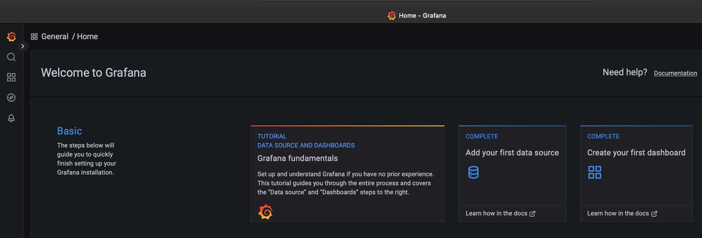
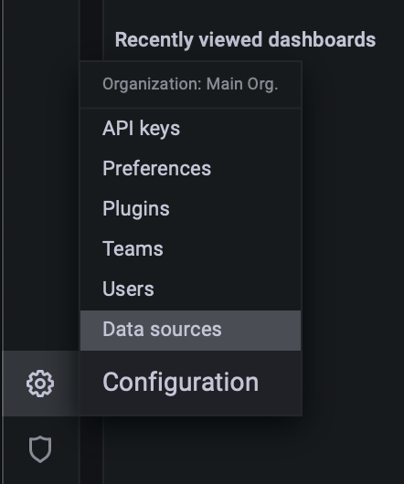
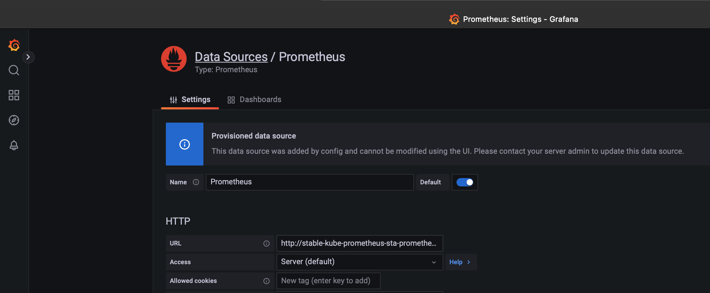
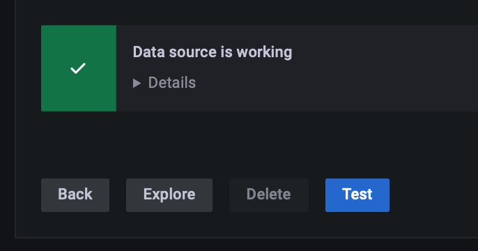
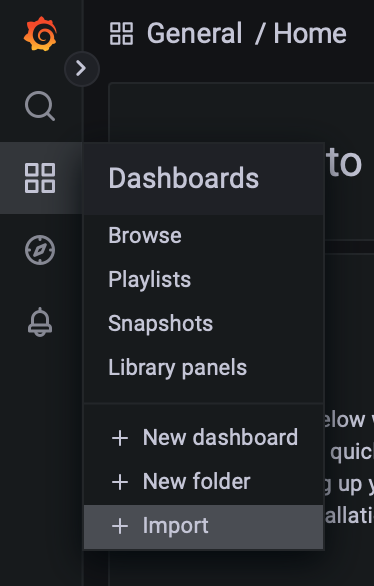
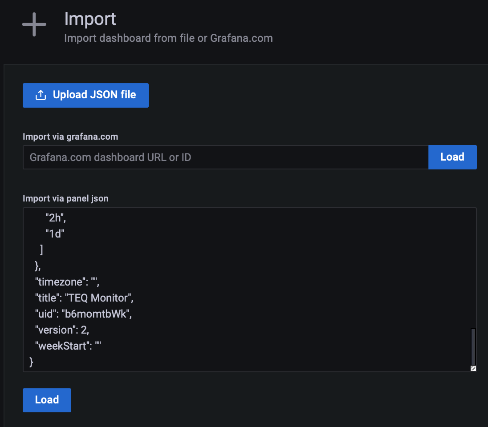
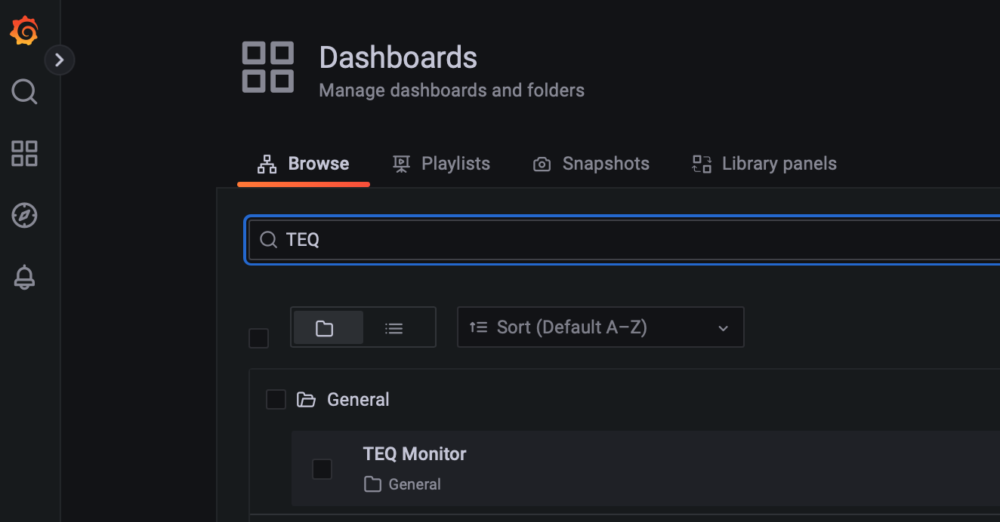
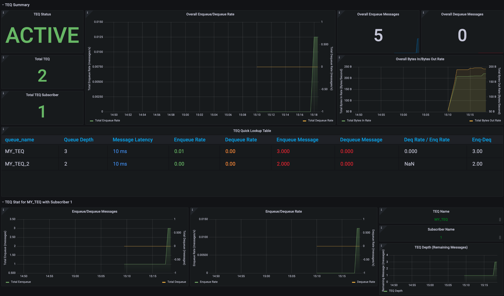

# Monitoring your Oracle Transactional Event Queues

As you may know [Oracle Transactional Event Queues](https://docs.oracle.com/en/database/oracle/oracle-database/21/adque/index.html) is a fault-tolerant, scalable, real-time messaging backbone offered by converged Oracle Database that allows you to build an enterprise-class event-driven architectures. 

Have access to the real-time broker, producer, and consumer metrics in a single-pane dashboard and receive alerts for only important issues is key for allows teams to watch and understand the state of their systems.

Oracle Observability Exporter gather the Oracle TEQ metrics and expose through HTTP endpoint as a _target_ to Prometheus collecting and handle them.

## Solution overview

The solution in this session is part of the Unified Observability strategy for Oracle Database but will focus only in Oracle TEQ Metrics handling the two following issues:

- Gather the Oracle TEQ metrics and expose them through an HTTP endpoint using Prometheus standard using Oracle Observability Exporter.

- Deploy Prometheus and Grafana stack to create a single-pane of glass to present Oracle TEQ Metrics on a Grafana Dashboard.


## Walkthrough

We provide a method to configure this solution setting up the resources following high-level steps:

1. Create an Oracle TEQ topic.
2. Create Oracle Database secret inside Kubernetes needed for the solution.
3. Create ConfigMap to store TNS_ADMIN data needed to connect with Oracle Database.
4. Create ConfigMap to store Oracle TEQ default metrics configuration file.
5. Deploy Oracle Database Observability Exporter inside Kubernetes.
6. Deploy Service and Monitor Services.
7. Set up Grafana Dashboard to load Oracle TEQ Metrics.

## Prerequisites

For this walkthrough, the following prerequisites are necessary:

- An Oracle Databsase 21c instance running.
- An Oracle User with needed grants to create Oracle TEQ and execute AQ JMS commands.
- A Kubernetes infrastructure running with Grafana and Prometheus instances running and configured.

---

## Set up proactive monitoring in Oracle TEQ

In this section, we walk through the process to set up the resources for active monitoring Oracle TEQ.

### Create an Oracle TEQ topic

We first create a standard Oracle TEQ topic and subscribe to it in order to receive events. We will connect to Oracle Database and execute the script [createTEQ.sql](scripts/createTEQ.sql)

```bash
# Access Oracle Database using SQLcl tool.
sql /nolog
```

```sql
-- Connect using Oracle Database User with needed grants
SQLcl: Release 21.4 Production on Tue Jan 25 00:10:07 2022

Copyright (c) 1982, 2022, Oracle.  All rights reserved.

SQL> connect 'DB USER'@'DATABASE HOST:PORT'/'DB SERVICE NAME''
Password? (**********?) ****************
Connected.
```

```sql
--- Run script to create Oracle TEQ Topic.
SQL> @/scripts/createTEQ.sql
SQL>
SQL> begin
 2   -- create the TEQ
 3   dbms_aqadm.create_transactional_event_queue(
 4       queue_name         => 'my_teq',
 5       -- when mutiple_consumers is true, this will create a pub/sub "topic" - the default is false
 6       multiple_consumers => true
 7   );
 8   
 9   -- start the TEQ
10    dbms_aqadm.start_queue(
11        queue_name         => 'my_teq'
12    ); 
13 end;
14 /
...
...
...

PL/SQL procedure successfully completed.
```

If you already have an existing TEQ topic that you want to use, you can skip to the next step.

### Create Oracle Database secret

This step creates the K8s secret to store the Oracle Database User credentials that is used by Oracle Observability Exporter.

```bash
kubectl create secret generic db-secret         \
        --from-literal=username=<"DB USERNAME"> \
        --from-literal=password=<"DB PASSWORD"> \
        --namespace <"NAMESPACE">
```

> Attention: We assume that Exporter will be deployed in the K8s namespace "NAMESPACE."

### Create ConfigMap to store TNS_ADMIN

This step creates the K8s ConfigMap to store the Oracle Database TNS data that is used by Oracle Observability Exporter.

```bash
kubectl create configmap db-metrics-tns-admin \
        --from-file=TNS_ADMIN/tnsnames.ora    \
        --namespace <"NAMESPACE">
```

### Create ConfigMap to store TEQ Metrics Configuration

This step creates the K8s ConfigMap to store the TEQ metrics configuration file that is used by Oracle Observability Exporter.

```bash
kubectl create configmap db-metrics-teq-exporter-config  \
        --from-file=metrics/default-metrics-teq.toml     \
        --namespace <"NAMESPACE">
```

### Deploy Oracle Database Observability Exporter

This step request the deployment of the Oracle Database Observability Exporter in Kubernetes.

```bash
kubectl create -f teq-metrics-exporter-deployment.yaml  \
        --namespace <"NAMESPACE">
```

```bash
kubectl logs pods/db-metrics-exporter-75948b556f-28btc -n msdataworkshop                                                                                

  .   ____          _            __ _ _
 /\\ / ___'_ __ _ _(_)_ __  __ _ \ \ \ \
( ( )\___ | '_ | '_| | '_ \/ _` | \ \ \ \
 \\/  ___)| |_)| | | | | || (_| |  ) ) ) )
  '  |____| .__|_| |_|_| |_\__, | / / / /
 =========|_|==============|___/=/_/_/_/
 :: Spring Boot ::                (v2.7.0)

2022-07-11 12:07:26.305  INFO 1 --- [           main] o.o.ObservabilityExporterApplication     : Starting ObservabilityExporterApplication v0.1.0 using Java 11.0.15 on db-metrics-exporter-75948b556f-28btc with PID 1 (/usr/share/observability-exporter.jar started by root in /)
2022-07-11 12:07:26.313  INFO 1 --- [           main] o.o.ObservabilityExporterApplication     : No active profile set, falling back to 1 default profile: "default"
2022-07-11 12:07:28.448  INFO 1 --- [           main] o.s.b.w.embedded.tomcat.TomcatWebServer  : Tomcat initialized with port(s): 9161 (http)
2022-07-11 12:07:28.470  INFO 1 --- [           main] o.apache.catalina.core.StandardService   : Starting service [Tomcat]
2022-07-11 12:07:28.470  INFO 1 --- [           main] org.apache.catalina.core.StandardEngine  : Starting Servlet engine: [Apache Tomcat/9.0.63]
2022-07-11 12:07:28.611  INFO 1 --- [           main] o.a.c.c.C.[Tomcat].[localhost].[/]       : Initializing Spring embedded WebApplicationContext
2022-07-11 12:07:28.611  INFO 1 --- [           main] w.s.c.ServletWebServerApplicationContext : Root WebApplicationContext: initialization completed in 2174 ms
.......
.......
.......
2022-07-11 12:07:31.856  INFO 1 --- [           main] o.s.b.w.embedded.tomcat.TomcatWebServer  : Tomcat started on port(s): 9161 (http) with context path ''
2022-07-11 12:07:31.880  INFO 1 --- [           main] o.o.ObservabilityExporterApplication     : Started ObservabilityExporterApplication in 6.697 seconds (JVM running for 7.74)
2022-07-11 12:07:32.370  INFO 1 --- [nio-9161-exec-2] o.a.c.c.C.[Tomcat].[localhost].[/]       : Initializing Spring DispatcherServlet 'dispatcherServlet'
2022-07-11 12:07:32.370  INFO 1 --- [nio-9161-exec-2] o.s.web.servlet.DispatcherServlet        : Initializing Servlet 'dispatcherServlet'
2022-07-11 12:07:32.371  INFO 1 --- [nio-9161-exec-2] o.s.web.servlet.DispatcherServlet        : Completed initialization in 1 ms
```

### Deploy Service and Monitor Services

Once we have the `ObservabilityExporterApplication` running, we can expose its service that will be the target monitored by Prometheus ServiceMonitor component, also deployed in this task. First let's deploy the Oracle Observability Exporter service.

```bash
kubectl create -f teq-metrics-exporter-service.yaml  \
        --namespace <"NAMESPACE">
```

Now let's deploy the Prometheus ServiceMonitor component that will access the Observability Exporter service every 20 seconds and get the metrics made available by it.

```bash
kubectl create -f teq-metrics-exporter-monitor.yaml  \
        --namespace <"NAMESPACE">
```

### Set up Grafana Dashboard

This step illustrates how to create the Grafana Dashboard to proactively monitoring the Oracle Transactional Event Queues. As an assumption, you already have a Grafana and Prometheus stack up and configured, so we will create the Dashboard to monitor the TEQ.

1. Open a new browser tab in the grafana path as the URL:

    `https://<EXTERNAL-IP>/grafana`

    

2. View pre-configured Prometheus data source:

    Select the Configuration gear icon on the left-hand side and select Data Sources.

    

    Click the Prometheus option.

    

    Click Test button and verify success.

    

    Click the Back button.

3. Install the Oracle TEQ ("TEQ Monitor") Dashboard

    Select the + icon on the left-hand side and select Import

    

    Copy the contents of the [TEQ Dashboard JSON](dashboards/teq-dashboard-basics.json)

    Paste the contents in the Import via panel json text field and click the Load button

    

    Confirm upload and click Import button.

4. Open and Study the TEQ Monitor Dashboard Screen and Metrics    

    Select the four squares icon on the left-hand side and select 'Dashboards'

    In the Dashboards panel query for `TEQ`

    

    In the Dashboards panel select `TEQ Monitor` to access Dashboard and study their content which includes metrics about:
    - Subscribers
    - Message counts, latency, etc.
    - Enqueue and Dequeue rates

        

    > Note: the metrics are presented as soon as the events are being produced and consumed in the topics. If you want to simulate you can use the scripts samples [produceTEQ.sql](scripts/produceTEQ.sql) and [consumeTEQL.sql](scripts/consumeTEQ.sql).

## Learn More

- Ask for help and connect with us on the [Oracle DB Microservices Slack Channel](https://bit.ly/oracle-db-microservices-help-slack) channel #oracle-db-microservices

- Experiment our workshop [Unified Observability in Grafana with converged Oracle Database](http://bit.ly/unifiedobservability)

- Our blog [Unified Observability: Metrics, Logs, and Tracing of App and Database Tiers in a Single Grafana Console](https://blogs.oracle.com/developers/post/unified-observability-metrics-logs-and-tracing-of-app-and-database-tiers-in-a-single-grafana-console)