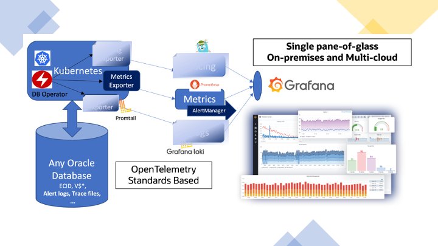

# Monitoring your Oracle Transactional Event Queues

As you may know [Oracle Transactional Event Queues](https://docs.oracle.com/en/database/oracle/oracle-database/21/adque/index.html) is a fault-tolerant, scalable, real-time messaging backbone offered by converged Oracle Database that allows you to build an enterprise-class event-driven architectures. 

Have access to the real-time broker, producer, and consumer metrics in a single-pane dashboard and receive alerts for only important issues is key for allows teams to watch and understand the state of their systems.

Oracle Observability Exporter gather the Oracle TEQ metrics and expose through HTTP endpoint as a _target_ to Prometheus collecting and handle them.

## Solution overview

The solution in this session is part of the Unified Observability strategy for Oracle Database but will focus only in Oracle TEQ Metrics handling the two following issues:

- Gather the Oracle TEQ metrics and expose them through an HTTP endpoint using Prometheus standard using Oracle Observability Exporter.

- Deploy Prometheus and Grafana stack to create a single-pane of glass to present Oracle TEQ Metrics on a Grafana Dashboard.

## Walkthrough

We provide two methods to configure this solution: set up the resources manually through various AWS services, or deploy the resources with an AWS CloudFormation template. Both methods complete the following high-level steps:

1. Create an SNS topic.
2. Create AWS Identity and Access Management (IAM) roles and policies needed for the solution.
3. Create a Lambda function with the provided code and assign the appropriate IAM roles.

We then walk you through identifying the log group to monitor, creating a trigger in the Lambda function, and testing the error notification system.

## Prerequisites

For this walkthrough, the following prerequisites are necessary:

